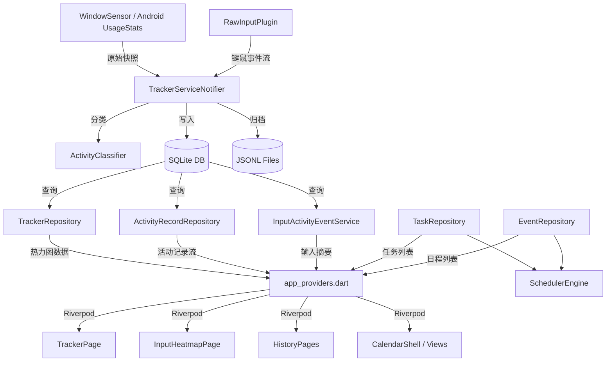

<p align="center">
  
</p>

<h1 align="center">FlowPlan — AI 智能排程日历</h1>

<p align="center">
  <strong>跨平台本地优先任务管理 · 活动追踪 · 智能调度</strong>
</p>

<p align="center">
  
  
  
  
  
</p>

---

## 📋 目录

- [项目概述](#-项目概述)
- [核心功能](#-核心功能)
- [技术架构](#-技术架构)
- [项目结构](#-项目结构)
- [代码统计](#-代码统计)
- [数据库设计](#-数据库设计)
- [平台适配](#-平台适配)
- [依赖清单](#-依赖清单)
- [快速开始](#-快速开始)
- [发布验证](#-发布验证)
- [路由与页面](#-路由与页面)
- [核心模块详解](#-核心模块详解)
- [数据流架构](#-数据流架构)
- [开发路线图](#-开发路线图)

---

## 🎯 项目概述

**FlowPlan** 是一款面向中文母语者的跨平台智能排程日历与活动追踪应用，基于 Flutter 构建，采用本地优先（Local-first）的数据策略。它将日历管理、任务排程、活动追踪与输入行为分析融合为一体，致力于帮助用户理解"时间都去哪了"，并通过 AI 贪心算法实现一键智能排程。

### 设计理念

| 理念 | 说明 |
|------|------|
| **中文优先** | 所有 UI 文案、标签、状态词均为简体中文 |
| **本地优先** | SQLite 数据库 + JSONL 日志双写，数据完全本地掌控 |
| **隐私安全** | 活动追踪数据不上传云端，输入事件仅保留统计摘要 |
| **跨平台一致** | Windows 桌面 + Android 手机/平板，统一体验 |
| **渐进式展示** | 热力图根据使用时长自适应展示，从小时、日到月、年 |

---

## ✨ 核心功能

### 1. 📅 日历管理

- **时间轴视图（Timeline）**：以 24 小时连续时间轴展示日程与任务，支持拖拽安排
- **周视图（Week）**：七日横向并排展示，纵向为时间轴
- **月视图（Month）**：传统月历网格，基于 `table_calendar` 组件，支持日期快速跳转
- **日程详情编辑**：支持标题、时间范围、全天事件、所属日历簿、颜色标记、备注等字段
- **日历簿管理**：支持创建、编辑、删除多个日历簿（区分日程簿与待办簿），每个簿可独立设置颜色与可见性
- **拖拽排程**：支持在时间轴上通过拖拽重新安排任务和日程的时间

### 2. ✅ 任务管理

- **快速添加栏**：底部常驻输入栏，一键创建新任务
- **未排程任务面板**：左侧滑出面板，展示所有尚未安排时间的待办任务
- **任务详情页**：支持标题、描述、优先级（高/中/低）、预计时长、截止日期、所属清单、标签等字段
- **任务清单管理**：支持创建和管理多个任务清单
- **追踪证据关联**：任务详情页可直接查看关联的工作会话、原始活动记录、输入行为证据

### 3. 🤖 智能调度

- **贪心自动排程算法**：`SchedulerEngine` 基于优先级排序 + 空闲时段扫描，一键将未排程任务填入当天可用时段
- **避障策略**：自动避开已有日程事件和已排程任务
- **智能起点**：如果是今天，从当前时间开始排程（向上取整到 15 分钟粒度）
- **工作时间约束**：默认 8:00-22:00 工作时间范围

### 4. 🔍 活动追踪（核心亮点）

这是 FlowPlan 最大的差异化模块，占项目总代码量的 ~60%。

#### 4.1 前台窗口采集

- **Windows**：通过 Win32 FFI（`GetForegroundWindow` / `QueryFullProcessImageName`）实时感知当前前台应用的进程名、窗口类名、窗口标题、全屏状态
- **Android**：通过 `PACKAGE_USAGE_STATS` 系统权限，启动时增量读取应用使用记录
- **FlowPlan 自排除**：应用自身窗口默认排除在追踪结果之外，避免污染数据

#### 4.2 活动分类引擎

`ActivityClassifier` 支持基于进程名/包名的规则匹配，内置 200+ 条分类规则，涵盖：

| 分类 | 示例应用 |
|------|----------|
| 开发 | VS Code, IntelliJ, Android Studio, Git, Terminal |
| 浏览器 | Chrome, Firefox, Edge, Safari |
| 通讯 | 微信, QQ, 钉钉, Slack, Teams, Discord |
| 办公 | Word, Excel, PowerPoint, WPS |
| 设计 | Photoshop, Figma, Sketch, Blender |
| 娱乐 | 网易云音乐, Spotify, 哔哩哔哩 |
| 游戏 | Steam, Epic, 各类游戏进程 |
| 系统 | 文件管理器, 设置, 任务管理器 |
| 参考 | Notion, Obsidian, 有道词典 |

#### 4.3 工作会话合并

原始活动记录会被智能合并为连续的"工作会话"（`WorkSession`），解决窗口频繁切换导致的碎片化问题：

- **去抖策略**：短时间内的窗口切换不立即切断会话
- **桥接合并**：跨应用但同一工作上下文的短切换可合并
- **连续短打断吸收**：一串连续的短暂打断后回到同一上下文的活动可桥接
- **FlowPlan 打断无感**：切到 FlowPlan 自身查看数据后再切回，不打断原工作会话
- **双层展示**：先看合并后的工作段摘要，再展开查看原始切换明细

#### 4.4 键鼠输入追踪

- **Windows 原生层**：通过 C++ `Raw Input Plugin`（`raw_input_plugin.cpp`，21KB 原生代码）注册全局 `WM_INPUT` 监听，捕获键盘按下/释放事件、鼠标按键/滚轮/移动事件
- **顺序事件流**：每条输入事件带有时间戳、顺序号、按键/按钮信息、当前前台窗口上下文
- **SQLite 持久化**：`tracked_input_events` 表存储完整键鼠事件流
- **JSONL 归档**：按天写入 `YYYY-MM-DD.input-events.jsonl` 文件

#### 4.5 输入行为分析

- **键盘热力图**：可视化键盘按键频率分布
- **鼠标热力图**：可视化鼠标按键/滚轮/移动分布
- **高频按键榜单**：展示最常用的按键及输入占比
- **应用内输入强度**：对比各应用的键盘、点击、滚轮、鼠标移动、活跃分钟维度强度
- **时间段分布**：24 小时柱状图展示输入强度变化，标注峰值时段
- **输入行为摘要**：每日输入总量、活跃分钟数、平均每分钟事件数
- **应用/时段筛选交互联动**

#### 4.6 热力图时间尺度浏览器

- 支持 **小时** / **日** / **月** / **年** 四种时间尺度
- 根据数据积累时长自动推荐默认尺度（首日用小时、数周用日、数月用月、长期用年）
- 支持逐层下钻（年→月→日→小时）
- 热力图区间可联动筛选下方工作会话和原始日志列表

#### 4.7 区间分析

选中任意时间桶后可查看该区间的聚合分析：

- 区间总时长 / 有效输入时长
- 工作会话数 / 原始日志数
- 活跃应用数 / 按键总数
- 日志类型分布 / 主要应用 / 主要分类
- 区间工作会话列表（支持最近优先/时长优先/输入优先排序）
- 区间原始日志预览（支持关键词搜索和日志类型筛选）
- 日期分布摘要
- 本地二次筛选（应用/分类/仅看有输入活动）

#### 4.8 历史记录系统

- **原始日志**：SQLite `raw_activity_logs` 表 + 按天 JSONL 文件双写
- **历史日志页**：按天浏览归档文件，支持关键词搜索、日志类型筛选、详情展开
- **完整输入历史页**：按天浏览输入事件 JSONL，支持输入类型筛选
- **数据库导出**：支持导出 SQLite 数据库副本、打开数据库所在目录

### 5. 🔄 数据同步

- **Outlook 日历同步**：通过 Microsoft Graph API，支持 OAuth2 认证、日历事件的双向增量同步
- **iCalendar 导入导出**：支持标准 `.ics` 文件的解析导入和批量导出

### 6. ⚙️ 应用设置

- **主题切换**：亮色/暗色/跟随系统三种模式
- **常规设置**：时间格式、默认视图、默认任务时长等
- **Windows 专属**：系统托盘常驻、关闭窗口时缩到托盘、开机自启动（计划任务方案）
- **追踪控制**：采样间隔设置、追踪状态开关
- **数据管理**：导出数据库、打开存储目录、查看历史日志入口

---

## 🏗️ 技术架构

```
┌──────────────────────────────────────────────────────────────────┐
│                        FlowPlan App                             │
│                    MaterialApp.router                           │
│                  (go_router + 双主题)                            │
├──────────────────────────────────────────────────────────────────┤
│  Presentation Layer                                             │
│  ┌──────────┐ ┌──────────┐ ┌──────────┐ ┌──────────┐          │
│  │ Calendar  │ │  Task    │ │ Tracker  │ │ Settings │          │
│  │  Shell    │ │  Detail  │ │  Page    │ │  Page    │          │
│  │ Timeline  │ │  Quick   │ │ Heatmap  │ │ Outlook  │          │
│  │ Week/Month│ │  Add Bar │ │ History  │ │ iCal     │          │
│  └──────────┘ └──────────┘ └──────────┘ └──────────┘          │
├──────────────────────────────────────────────────────────────────┤
│  State Management (Riverpod)                                    │
│  ┌──────────────────────────────────────────────────────┐      │
│  │ app_providers.dart (40+ Providers)                    │      │
│  │ settings_provider.dart (主题/托盘/自启动)              │      │
│  │ tracker_service.dart (TrackerServiceNotifier)         │      │
│  └──────────────────────────────────────────────────────┘      │
├──────────────────────────────────────────────────────────────────┤
│  Domain / Service Layer                                         │
│  ┌────────────┐ ┌──────────────┐ ┌───────────────────┐        │
│  │ Scheduler   │ │ Activity     │ │ Activity Log      │        │
│  │ Engine      │ │ Classifier   │ │ Service           │        │
│  ├────────────┤ ├──────────────┤ ├───────────────────┤        │
│  │ Sync Engine │ │ Window Sensor│ │ Input Event       │        │
│  │ MS Graph    │ │ Raw Input    │ │ Service           │        │
│  │ Outlook Auth│ │ Service      │ │ Android Usage     │        │
│  └────────────┘ └──────────────┘ └───────────────────┘        │
├──────────────────────────────────────────────────────────────────┤
│  Data Layer                                                     │
│  ┌──────────────────────┐  ┌──────────────────────────┐       │
│  │ Drift (SQLite ORM)   │  │ JSONL File Archives      │       │
│  │ 9 Tables + 3 Runtime │  │ activity / input-events  │       │
│  │ app_database.g.dart  │  │ 按天分割，永久保留          │       │
│  └──────────────────────┘  └──────────────────────────┘       │
├──────────────────────────────────────────────────────────────────┤
│  Platform Layer                                                 │
│  ┌──────────────────┐  ┌──────────────────────────────┐       │
│  │ Windows Native   │  │ Android Native               │       │
│  │ Raw Input Plugin │  │ usage_stats Package           │       │
│  │ Desktop Shell    │  │ permission_handler            │       │
│  │ System Tray      │  │ PACKAGE_USAGE_STATS           │       │
│  │ Win32 FFI        │  │                               │       │
│  └──────────────────┘  └──────────────────────────────┘       │
└──────────────────────────────────────────────────────────────────┘
```

### 核心技术栈

| 层级 | 技术 | 说明 |
|------|------|------|
| **框架** | Flutter 3.5+ / Dart 3.5+ | 跨平台 UI 框架 |
| **状态管理** | Riverpod 2.x | 40+ Provider 管理全局/局部状态 |
| **路由** | go_router | 声明式路由 + ShellRoute 侧栏导航 |
| **数据库** | Drift 2.22 (SQLite) | 类型安全 ORM，支持迁移和流式查询 |
| **代码生成** | build_runner + freezed + json_serializable | 数据类、序列化、Riverpod 代码生成 |
| **动画** | flutter_animate | 入场/过渡动画 |
| **日历** | table_calendar | 月视图日历网格 |
| **通知** | flutter_local_notifications | 提醒推送 |
| **Windows FFI** | win32 + ffi + 自定义 C++ Plugin | 窗口感知、原始输入、系统托盘 |
| **Android** | usage_stats + permission_handler | 应用使用时长读取 |

---

## 📂 项目结构

```
flowplan/
├── lib/
│   ├── main.dart                          # 应用入口、初始化、Riverpod ProviderScope
│   ├── app.dart                           # MaterialApp.router 配置（双主题 + go_router）
│   │
│   ├── core/                              # 基础设施层
│   │   ├── database/                      # Drift 数据库
│   │   │   ├── app_database.dart          # 数据库定义、迁移、设置存取 (327 行)
│   │   │   ├── app_database.g.dart        # 代码生成文件 (270KB)
│   │   │   └── tables/                    # 9 张数据表定义
│   │   │       ├── activity_records_table.dart
│   │   │       ├── app_usage_rules_table.dart
│   │   │       ├── calendar_events_table.dart
│   │   │       ├── event_calendars_table.dart
│   │   │       ├── projects_table.dart
│   │   │       ├── tags_table.dart
│   │   │       ├── task_items_table.dart
│   │   │       ├── task_lists_table.dart
│   │   │       └── time_blocks_table.dart
│   │   ├── platform/                      # 平台层服务
│   │   │   ├── desktop_shell_service.dart  # Windows 原生壳桥接（托盘/窗口控制）
│   │   │   └── device_identity_service.dart # 设备唯一标识
│   │   ├── router/
│   │   │   └── app_router.dart            # go_router 路由配置 (15 个路由)
│   │   ├── storage/
│   │   │   └── app_storage.dart           # 存储路径解析（debug/profile/release 隔离）
│   │   └── theme/
│   │       └── app_theme.dart             # 亮/暗双主题 + 设计令牌 (紫罗兰主色调)
│   │
│   ├── features/                          # 功能模块层
│   │   ├── calendar/                      # 📅 日历模块
│   │   │   ├── data/
│   │   │   │   ├── calendar_books_repository.dart
│   │   │   │   └── event_repository.dart
│   │   │   ├── domain/                    # 领域模型（空，Drift 表兼做）
│   │   │   └── presentation/
│   │   │       ├── calendar_shell.dart     # 主布局壳（侧栏导航 + 内容区）(832 行)
│   │   │       ├── timeline_view.dart      # 时间轴视图 (664 行)
│   │   │       ├── week_view.dart          # 周视图 (299 行)
│   │   │       ├── month_view.dart         # 月视图 (304 行)
│   │   │       ├── event_detail_page.dart  # 日程详情/编辑 (491 行)
│   │   │       ├── calendar_books_page.dart # 日历簿管理 (550 行)
│   │   │       └── widgets/               # 日历专用组件
│   │   │
│   │   ├── task/                          # ✅ 任务模块
│   │   │   ├── data/
│   │   │   │   └── task_repository.dart    # 任务 CRUD + 批量排程
│   │   │   ├── domain/
│   │   │   └── presentation/
│   │   │       ├── task_detail_page.dart   # 任务详情/编辑 (503 行)
│   │   │       ├── quick_add_bar.dart      # 底部快速添加栏 (175 行)
│   │   │       ├── unscheduled_task_panel.dart  # 未排程任务侧栏 (302 行)
│   │   │       └── widgets/
│   │   │           └── task_tracker_evidence_section.dart  # 任务追踪证据 (774 行)
│   │   │
│   │   ├── tracker/                       # 🔍 活动追踪模块（最大模块）
│   │   │   ├── data/
│   │   │   │   ├── tracker_repository.dart         # 热力图/历史聚合查询 (427 行)
│   │   │   │   └── activity_record_repository.dart  # 活动记录 CRUD (160 行)
│   │   │   ├── domain/
│   │   │   ├── models/                    # 数据模型
│   │   │   │   ├── work_session.dart       # 工作会话 + 合并算法 (493 行)
│   │   │   │   ├── activity_insights.dart  # 活动洞察/统计 (211 行)
│   │   │   │   ├── activity_log_entry.dart # 原始日志条目 (212 行)
│   │   │   │   ├── tracked_input_event.dart # 键鼠事件模型 (264 行)
│   │   │   │   ├── input_heatmap_summary.dart  # 输入热力图摘要 (183 行)
│   │   │   │   ├── input_event_query.dart  # 查询参数 (38 行)
│   │   │   │   └── activity_log_archive_day.dart  # 归档日模型 (12 行)
│   │   │   ├── services/                  # 服务层
│   │   │   │   ├── tracker_service.dart    # 追踪主服务 (574 行)
│   │   │   │   ├── input_activity_event_service.dart  # 输入事件服务 (1,150 行)
│   │   │   │   ├── activity_log_service.dart  # 日志归档服务 (376 行)
│   │   │   │   ├── activity_classifier.dart   # 活动分类引擎 (342 行)
│   │   │   │   ├── raw_input_service.dart  # 原始输入桥接 (355 行)
│   │   │   │   ├── android_usage_import_service.dart  # Android 使用导入 (409 行)
│   │   │   │   ├── android_usage_stats_service.dart   # Android 使用统计 (111 行)
│   │   │   │   └── window_sensor.dart      # Win32 窗口感知 (101 行)
│   │   │   ├── presentation/              # 界面层
│   │   │   │   ├── tracker_page.dart       # 追踪主页 (5,440 行) ⭐ 最大文件
│   │   │   │   ├── input_heatmap_page.dart # 键鼠热力图 (1,663 行)
│   │   │   │   ├── tracker_input_history_page.dart  # 输入历史 (865 行)
│   │   │   │   └── tracker_log_history_page.dart    # 日志历史 (846 行)
│   │   │   ├── widgets/
│   │   │   │   └── heatmap_widget.dart     # 通用热力图组件 (582 行)
│   │   │   └── tracker_defaults.dart       # 追踪默认配置
│   │   │
│   │   ├── scheduler/                     # 🤖 智能调度模块
│   │   │   └── scheduler_engine.dart       # 贪心调度算法 (134 行)
│   │   │
│   │   ├── sync/                          # 🔄 同步模块
│   │   │   ├── outlook_auth_service.dart   # OAuth2 认证 (177 行)
│   │   │   ├── ms_graph_service.dart       # Microsoft Graph API (149 行)
│   │   │   ├── sync_engine.dart            # 增量同步引擎 (104 行)
│   │   │   └── outlook_settings_page.dart  # Outlook 同步设置页 (427 行)
│   │   │
│   │   ├── ical/                          # 📥 iCalendar 模块
│   │   │   ├── ical_parser.dart            # .ics 文件解析器 (112 行)
│   │   │   ├── ical_exporter.dart          # .ics 文件导出器 (64 行)
│   │   │   └── ical_import_export_page.dart # 导入导出管理页 (282 行)
│   │   │
│   │   └── settings/                      # ⚙️ 设置模块
│   │       └── presentation/
│   │           └── settings_page.dart      # 设置页 (254 行)
│   │
│   └── shared/                            # 共享层
│       ├── providers/
│       │   ├── app_providers.dart          # 全局 Provider 注册 (345 行)
│       │   ├── settings_provider.dart      # 设置状态管理 (268 行)
│       │   └── database_provider.dart      # 数据库 Provider
│       └── widgets/
│           ├── task_block.dart             # 时间轴任务色块 (192 行)
│           ├── blocked_time_block.dart     # 锁定时间色块 (57 行)
│           └── time_indicator.dart         # 当前时间红线 (60 行)
│
├── windows/                               # Windows 平台层
│   └── runner/
│       ├── raw_input_plugin.cpp           # 全局键鼠监听原生插件 (21KB) ⭐
│       ├── raw_input_plugin.h
│       ├── flutter_window.cpp             # 窗口管理 + 托盘常驻 (9.4KB)
│       ├── flutter_window.h
│       ├── desktop_shell_plugin.cpp       # 桌面壳桥接（窗口控制/自启动）(9KB)
│       ├── desktop_shell_plugin.h
│       ├── win32_window.cpp               # Win32 窗口基类
│       ├── win32_window.h
│       └── main.cpp                       # Windows 入口
│
├── android/                               # Android 平台层
│   └── app/
│       └── build.gradle.kts               # Android 16+ (API 36)
│
├── assets/
│   ├── icons/                             # 应用图标
│   └── images/                            # 图片资源
│
├── pubspec.yaml                           # 依赖与项目元数据
├── CODEX.md                               # 产品任务总表与共识记录 (948 行)
└── analysis_options.yaml                  # Dart 分析选项
```

---

## 📊 代码统计

> 以下统计仅包含手写 Dart 源文件（排除 `*.g.dart` 和 `*.freezed.dart` 代码生成文件）。

### 总览

| 指标 | 数值 |
|------|------|
| **手写源文件数** | 68 |
| **手写代码行数** | 23,592 |
| **手写代码体积** | ~864 KB |
| **代码生成文件** | ~276 KB (`app_database.g.dart` 等) |
| **C++ 原生代码** | ~47 KB (Windows 平台插件) |
| **产品文档** | ~40 KB (`CODEX.md`) |

### 按模块分布

| 模块 | 文件数 | 代码行数 | 占比 |
|------|--------|----------|------|
| **tracker** (活动追踪) | 24 | 13,896 | 58.9% |
| **calendar** (日历) | 8 | 3,268 | 13.9% |
| **task** (任务) | 5 | 1,839 | 7.8% |
| **sync** (同步) | 4 | 857 | 3.6% |
| **shared** (共享) | 8 | 931 | 3.9% |
| **core** (基础) | 16 | 877 | 3.7% |
| **ical** (导入导出) | 3 | 458 | 1.9% |
| **settings** (设置) | 1 | 254 | 1.1% |
| **scheduler** (调度) | 1 | 134 | 0.6% |
| **入口文件** | 2 | 73 | 0.3% |

### 最大文件 Top 10

| 文件 | 行数 | 说明 |
|------|------|------|
| `tracker_page.dart` | 5,440 | 追踪主页（热力图+区间分析+日报+输入分析） |
| `input_heatmap_page.dart` | 1,663 | 键鼠热力图与输入行为分析 |
| `input_activity_event_service.dart` | 1,150 | 输入事件存储/查询/归档/热力图聚合 |
| `tracker_input_history_page.dart` | 865 | 完整输入事件历史浏览 |
| `tracker_log_history_page.dart` | 846 | 原始活动日志历史浏览 |
| `calendar_shell.dart` | 832 | 主布局壳（侧栏导航+键盘快捷键） |
| `task_tracker_evidence_section.dart` | 774 | 任务追踪证据展示 |
| `timeline_view.dart` | 664 | 24h 时间轴视图 |
| `heatmap_widget.dart` | 582 | 通用热力图渲染组件 |
| `tracker_service.dart` | 574 | 追踪核心服务（采样/会话/持久化） |

---

## 🗄️ 数据库设计

基于 **Drift (SQLite ORM)**，共 9 张 Schema 表 + 3 张运行时表。

### Schema 定义表

| 表名 | 说明 | 关键字段 |
|------|------|----------|
| `task_items` | 任务项 | id, summary, description, status, priority, dtstart, due, durationMinutes, taskListId, color, isLocked, tags |
| `task_lists` | 任务清单 | id, name, color, sortOrder |
| `calendar_events` | 日程事件 | id, uid, summary, dtstart, dtend, isAllDay, calendarId, location, description, color |
| `event_calendars` | 日历簿 | id, name, color, isVisible, isDefault, outlookCalendarId |
| `activity_records` | 活动记录 | id, processName, windowTitle, className, category, startedAt, endedAt, packageName, appLabel, deviceId, platform, source |
| `app_usage_rules` | 应用分类规则 | id, pattern, category, priority |
| `time_blocks` | 时间块 | id, type, dtstart, dtend, relatedTaskId |
| `projects` | 项目 | id, name, color, description |
| `tags` | 标签 | id, name, color |

### 运行时动态表

| 表名 | 说明 | 创建方式 |
|------|------|----------|
| `app_settings` | 应用设置(键值对) | `_ensureAppSettingsTable()` |
| `raw_activity_logs` | 原始追踪日志 | `_ensureRawActivityLogsTable()` |
| `tracked_input_events` | 键鼠事件流 | `_ensureTrackedInputEventsTable()` |

### 数据持久化策略

```
┌─────────────────────────────────────────────┐
│               采集源                         │
│  Windows: WindowSensor + RawInputPlugin      │
│  Android: PACKAGE_USAGE_STATS                │
├─────────────────────────────────────────────┤
│               写入                           │
│  ┌─────────────────┐  ┌──────────────────┐  │
│  │ SQLite 数据库     │  │  JSONL 日志文件   │  │
│  │ (主存储/索引/查询) │  │ (归档/审计/恢复)  │  │
│  │                  │  │                  │  │
│  │ activity_records │  │ YYYY-MM-DD       │  │
│  │ raw_activity_logs│  │  .activity.jsonl │  │
│  │ tracked_input_   │  │  .input-events   │  │
│  │   events         │  │  .jsonl          │  │
│  └─────────────────┘  └──────────────────┘  │
└─────────────────────────────────────────────┘
```

---

## 🖥️ 平台适配

### Windows

| 能力 | 实现方式 |
|------|----------|
| 前台窗口感知 | Dart FFI + win32 包（`GetForegroundWindow` / `QueryFullProcessImageName`） |
| 全局键鼠监听 | C++ `WM_INPUT` Raw Input Plugin（自定义 Flutter 插件） |
| 系统托盘常驻 | C++ `Shell_NotifyIcon` + `WM_TRAYICON` 消息处理 |
| 关闭缩到托盘 | Flutter MethodChannel ↔ C++ `flutter_window.cpp` |
| 开机自启动 | Windows 计划任务（`schtasks`），debug/release 独立注册 |
| 管理员权限 | manifest `requireAdministrator` |
| 全屏检测 | `GetWindowRect` vs `GetSystemMetrics` 比对 |

### Android

| 能力 | 实现方式 |
|------|----------|
| 应用使用记录 | `usage_stats` 包 + `PACKAGE_USAGE_STATS` 权限 |
| 权限管理 | `permission_handler` 包 |
| 最低版本 | Android 16 (API 36) |
| 数据策略 | 启动时增量读取 → 还原前台应用片段 → 写入统一追踪数据层 |
| 未实现 | 后台常驻/前台服务、本地键鼠输入采集 |

### 存储隔离

| 构建模式 | 存储目录名 | SharedPreferences 前缀 | 自启动任务名 |
|----------|-----------|----------------------|------------|
| Release | `flowplan` | (无前缀) | `FlowPlanStartup` |
| Profile | `flowplan_profile` | `flowplan.profile.` | 独立 |
| Debug | `flowplan_debug` | `flowplan.debug.` | 独立 |

---

## 📦 依赖清单

### 运行时依赖

| 分类 | 包名 | 版本 | 用途 |
|------|------|------|------|
| **状态管理** | `flutter_riverpod` | ^2.6.1 | 全局/局部状态管理 |
| | `riverpod_annotation` | ^2.6.1 | Riverpod 注解 |
| **路由** | `go_router` | ^14.8.1 | 声明式路由 |
| **数据库** | `drift` | ^2.22.1 | SQLite ORM |
| | `sqlite3_flutter_libs` | ^0.5.28 | SQLite 运行时 |
| **工具** | `path_provider` | ^2.1.5 | 平台存储路径 |
| | `uuid` | ^4.5.3 | RFC 4122 UUID 生成 |
| | `intl` | ^0.20.2 | 中文日期格式化 |
| | `collection` | ^1.19.1 | 集合工具扩展 |
| | `shared_preferences` | ^2.3.4 | 轻量设置存储 |
| **数据类** | `freezed_annotation` | ^2.4.4 | 不可变数据类注解 |
| | `json_annotation` | ^4.9.0 | JSON 序列化注解 |
| **动画** | `flutter_animate` | ^4.5.0 | 声明式动画 |
| **日历** | `table_calendar` | ^3.1.2 | 月视图日历组件 |
| **通知** | `flutter_local_notifications` | ^18.0.1 | 本地推送 |
| | `android_alarm_manager_plus` | ^5.0.0 | Android 闹钟 |
| | `workmanager` | ^0.9.0+3 | 后台任务 |
| **平台** | `win32` | ^5.8.0 | Windows FFI |
| | `ffi` | ^2.1.3 | Dart FFI |
| | `usage_stats` | ^1.3.1 | Android 使用统计 |
| | `permission_handler` | ^11.3.1 | 权限管理 |
| | `device_info_plus` | ^11.1.1 | 设备信息 |
| **其他** | `file_picker` | ^10.3.10 | 文件选择器 |
| | `http` | ^1.6.0 | HTTP 请求 |
| | `url_launcher` | ^6.3.2 | URL 打开 |

### 开发依赖

| 包名 | 版本 | 用途 |
|------|------|------|
| `build_runner` | ^2.4.14 | 代码生成执行器 |
| `drift_dev` | ^2.22.1 | Drift 代码生成 |
| `freezed` | ^2.5.8 | 数据类代码生成 |
| `json_serializable` | ^6.9.4 | JSON 序列化生成 |
| `riverpod_generator` | ^2.6.4 | Riverpod 代码生成 |
| `flutter_lints` | ^5.0.0 | 代码规范检查 |

---

## 🚀 快速开始

### 环境要求

- Flutter SDK ≥ 3.5.0
- Dart SDK ≥ 3.5.0
- Windows 10/11（Windows 构建）
- Android SDK, API 36+（Android 构建）
- Visual Studio 2022 + C++ 桌面开发负载（Windows 构建）

### 安装与运行

```bash
# 1. 克隆仓库
git clone <repo-url>
cd flowplan

# 2. 获取依赖
flutter pub get

# 3. 代码生成（Drift ORM、Freezed、Riverpod）
dart run build_runner build --delete-conflicting-outputs

# 4. 运行（Windows 桌面）
flutter run -d windows

# 5. 运行（Android 设备）
flutter run -d <android-device-id>

# 6. 构建发布版（Windows）
flutter build windows --release
```

### 注意事项

- Windows 版本要求管理员权限运行（manifest 中配置了 `requireAdministrator`）
- 首次运行时会自动创建数据库并插入默认日历簿、任务清单、分类规则等初始数据
- Debug 和 Release 版本使用独立的存储目录和设置，不会互相干扰
- 发布前请参考根目录 `RELEASE_CHECKLIST.md` 执行完整回归验证；Codex 不主动运行 `dart` / `flutter` 命令，需要由开发者本机执行并反馈结果。

---

## ✅ 发布验证

当前发布准备基线为 **v1.4.4+144**，对应根目录 `plan260424.md` 的 P1“信息架构与页面层级整理”收口阶段。

发布前建议至少完成：

- `flutter analyze` 保持 0 issues。
- Windows Release 构建通过，并手动验证托盘、系统通知、管理员权限、自启动和数据库路径。
- Android Release 构建通过，并手动验证 Outlook 登录、网络权限、Usage Stats 权限和手机 / 平板布局。
- Outlook 登录、手动同步、HTML 备注解析、地点、标题、时区、重置本地 Outlook 日历本后重新同步均正常。
- “全部任务与日程管理”页的搜索、筛选、多选、批量删除、批量完成任务均需要人工确认后再执行。
- 数据库导出 / 恢复、审计日志、更新日志和版本号链路保持一致。

详细命令、人工验收步骤和阻断项见根目录 `RELEASE_CHECKLIST.md`。

---

## 🗺️ 路由与页面

| 路由路径 | 页面 | 导航方式 |
|----------|------|----------|
| `/timeline` | 时间轴视图 | ShellRoute 侧栏（默认首页） |
| `/week` | 周视图 | ShellRoute 侧栏 |
| `/month` | 月视图 | ShellRoute 侧栏 |
| `/tracker` | 追踪主页 | ShellRoute 侧栏 |
| `/settings` | 设置页 | ShellRoute 侧栏 |
| `/tracker/day-details` | 追踪详细数据 | 追踪主页跳转 |
| `/tracker/log-history` | 历史日志浏览 | 追踪主页/设置页跳转 |
| `/tracker/input-history` | 输入事件历史 | 追踪主页跳转 |
| `/tracker/input-heatmap` | 键鼠热力图 | 追踪主页跳转 |
| `/task/create` | 新建任务 | 快速添加栏 |
| `/task/:id` | 任务详情 | 任务色块点击 |
| `/event/create` | 新建日程 | 日历交互 |
| `/event/:id` | 日程详情 | 日程色块点击 |
| `/ical` | iCal 导入导出 | 设置页跳转 |
| `/outlook-sync` | Outlook 同步设置 | 设置页跳转 |

---

## 🔬 核心模块详解

### TrackerServiceNotifier — 追踪主服务

追踪系统的核心状态机，管理采样循环、活动记录、输入事件的完整生命周期。

```
┌──────────┐    定时采样     ┌──────────────┐
│  start() ├───────────────→│   _sample()   │
└──────────┘   (每N秒一次)   ├──────────────┤
                            │ 1. 获取前台窗口快照      │
                            │ 2. 活动分类             │
                            │ 3. 判断是否切换上下文     │
                            │ 4. 更新/创建活动记录     │
                            │ 5. 采集输入事件          │
                            │ 6. 持久化到 DB + JSONL  │
                            │ 7. 更新展示状态          │
                            └──────────────┘
```

**关键设计**：
- `currentSnapshot` vs `displaySnapshot`：当切换到 FlowPlan 自身时，冻结展示状态为最近的外部工作会话，不刷新为自身
- 输入事件的窗口上下文绑定在原生后台线程中定时缓存刷新，避免每个事件重复查询进程信息
- Android 端通过 `_importAndroidUsage()` 在启动时一次性增量导入

### WorkSession — 工作会话合并算法

双层规则的去碎片化引擎：

1. **直接合并**：同一上下文（相同 processName + className）内短间隔记录直接合并
2. **桥接合并**：中间夹着短暂（< 阈值）、低输入的打断片段时，可桥接回前后同一上下文
3. **连续打断吸收**：一串连续短打断后回到同一上下文，整体吸收
4. **FlowPlan 打断无感**：自排除应用的打断不视为上下文切换

### ActivityClassifier — 活动分类引擎

两级规则匹配：用户自定义规则（高优先级）→ 内置默认规则。

匹配方式：进程名前缀/包含 → 窗口标题包含 → 包名匹配（Android）。

分类结果包含：`category`（分类名）、`displayName`（可读名称）、`signature`（唯一标识签名）。

### SchedulerEngine — 贪心调度算法

```
输入：待排程任务列表 + 当日已有日程
 ↓
按优先级排序（高→低），同级按截止日期排
 ↓
构建已占用时段列表（日程 + 已排任务）
 ↓
for 每个任务:
    扫描 [effectiveStart, 22:00) 找到第一个
    能容纳 task.duration 的空闲间隙
    →  找到则排入，并更新已占用列表
 ↓
输出：排程结果列表 [{id, dtstart}]
```

---

## 🔄 数据流架构



---

## 🗓️ 开发路线图

基于 `CODEX.md` 产品任务总表，当前版本处于 **Phase 2C — 追踪系统可用化** 阶段。

### ✅ 已完成

- [x] 基础 Flutter 应用框架与路由
- [x] 日历三视图（时间轴/周/月）+ 拖拽排程
- [x] 任务管理 + 快速添加 + 未排程面板
- [x] iCal 导入导出 + Outlook 增量同步
- [x] 贪心自动排程算法
- [x] Windows 前台窗口采集 + 活动分类
- [x] Windows 全局键鼠监听 + 输入事件持久化
- [x] 工作会话合并去碎片化（双层规则）
- [x] 热力图多尺度浏览器（小时/日/月/年 + 逐层下钻）
- [x] 区间分析面板（聚合统计 + 二次筛选 + 原始日志预览）
- [x] 输入行为分析（高频按键/应用强度/时段分布）
- [x] 追踪⇆工作会话⇆输入分析 双向联动
- [x] 任务追踪证据闭环（任务页查看关联工作会话与输入）
- [x] 系统托盘常驻 + 开机自启动（计划任务方案）
- [x] 数据库导出 + 历史日志文件 + 存储目录隔离
- [x] Android 基础适配（使用记录读取 + 增量导入）

### 🔜 规划中

- [ ] 追踪语义修正（FlowPlan 默认自排除策略完善）
- [ ] 日志与数据库索引/恢复策略
- [ ] 工作会话更智能的跨应用合并规则
- [ ] 热力图与历史日志/工作会话的深度联动筛选
- [ ] Telemetry V2（键盘分类统计/键序列/鼠标按键细分/滚轮距离）
- [ ] LLM 周期性纠偏与规则进化建议
- [ ] 生产力画像与自然语言排程增强
- [ ] 跨设备数据同步（手机查看电脑端追踪日志）

---

## 📄 补充文档

| 文档 | 路径 | 说明 |
|------|------|------|
| 产品任务总表 | `CODEX.md` | 产品共识、优先级排序、开发进展记录（948 行） |
| 阶段规划 | `implementation_plan.md` | 历史阶段规划与架构设计 |
| 任务清单 | `task.md` | 阶段任务与进度跟踪 |

---

<p align="center">
  <sub>FlowPlan v1.4.4 · 基于 Flutter & Dart 构建 · 中文优先 · 本地优先</sub>
</p>
