# FlowPlan 代码来源功能流程梳理

> 范围声明：本文只依据业务源码梳理，未读取 `README`、`docs`、`logs` 或其他说明文档。纳入范围为 `server/src`、`client_flutter/lib`、`client_flutter/android/app/src/main/kotlin`、`client_flutter/windows/runner`、`web_admin/src` 与业务 schema `server/src/database/p1_schema.sql`。排除生成代码、构建产物、依赖缓存与临时目录。

## 0. 代码边界与端划分

| 端 | 代码证据 | 代码中体现的职责 |
|---|---|---|
| 服务端 | `server/src/app.module.ts`、各 `*.controller.ts`、各 `*.service.ts`、`server/src/database/p1_schema.sql` | NestJS API、同步事实库、管理查询、文件/对象存储、追踪入库、AI/模型、报告、调度、Web API。 |
| Flutter 公共客户端层 | `client_flutter/lib/main.dart`、`client_flutter/lib/app.dart`、`client_flutter/lib/shared/providers/app_providers.dart`、`client_flutter/lib/core/server_api/*.dart`、`client_flutter/lib/core/server_first/*.dart`、`client_flutter/lib/core/sync/*.dart` | 多端共享 UI、Provider、HTTP API client、server-first 写入、离线队列、同步、追踪上传、本地 Drift 数据库。 |
| Flutter Windows 客户端 | `client_flutter/lib/core/platform/app_entry_io.dart`、`platform_bootstrap_io.dart`、`features/tracker/services/window_sensor.dart`、`raw_input_service.dart`、`desktop_shell_service.dart` | IO 启动、本地数据库恢复、启动追踪服务、Win32 前台窗口采样、RawInput 输入统计、托盘/开机启动/路径打开。 |
| Windows 原生 runner | `client_flutter/windows/runner/flutter_window.cpp`、`desktop_shell_plugin.cpp`、`raw_input_plugin.cpp` | 注册 Flutter 插件通道；系统托盘、关闭到托盘、启动到托盘；计划任务开机启动；ShellExecute 打开/定位路径；RawInput 后台采集键盘鼠标事件并返回 Dart。 |
| Flutter Android 客户端 | `client_flutter/lib/features/tracker/services/android_usage_stats_service.dart`、`android_usage_import_service.dart`、`features/reminders/reminder_service.dart` | 通过 MethodChannel 读取 UsageStats，导入 Android 前台应用会话；使用 Android exact alarm 能力做系统提醒。 |
| Android 原生代码 | `client_flutter/android/app/src/main/kotlin/com/flowplan/flowplan/MainActivity.kt`、`ReminderScheduler.kt`、`ReminderAlarmReceiver.kt`、`ReminderBootReceiver.kt` | `android_usage_stats` 查询权限/事件；`android_reminders` 安排/取消 exact alarm；闹钟触发通知；开机、时区、时间变化后重排提醒。 |
| Flutter Web 端 | `client_flutter/lib/core/platform/app_entry_web.dart`、`client_flutter/lib/web_app/flowplan_web_app.dart`、`web_api_client.dart`、`web_local_store.dart` | 浏览器本地配置、Web API client、`/web/*` 任务/事件/仪表盘、文件浏览/上传下载、追踪分析、报告/天气/推送配置；不具备桌面 RawInput、托盘、本地文件系统能力。 |
| React 管理端 | `web_admin/src/main.tsx` | 管理后台连接设置、登录、健康检查、数据中心、同步、文件、模型、报告、监控和运维操作面板，直接调用 `/api/admin/*`、`/api/ai/*`、`/api/files/*` 等。 |

## 1. 总体启动与端分流

代码证据：`client_flutter/lib/main.dart` 调用 `runFlowPlanEntry()`；`client_flutter/lib/core/platform/app_entry.dart` 用 conditional export 区分 `dart.library.io` 与 `dart.library.html`；IO 端在 `app_entry_io.dart` 注入本地数据库并进入 `FlowPlanPlatformBootstrapper`；Web 端在 `app_entry_web.dart` 加载 `WebLocalStore` 后运行 `FlowPlanWebApp`。

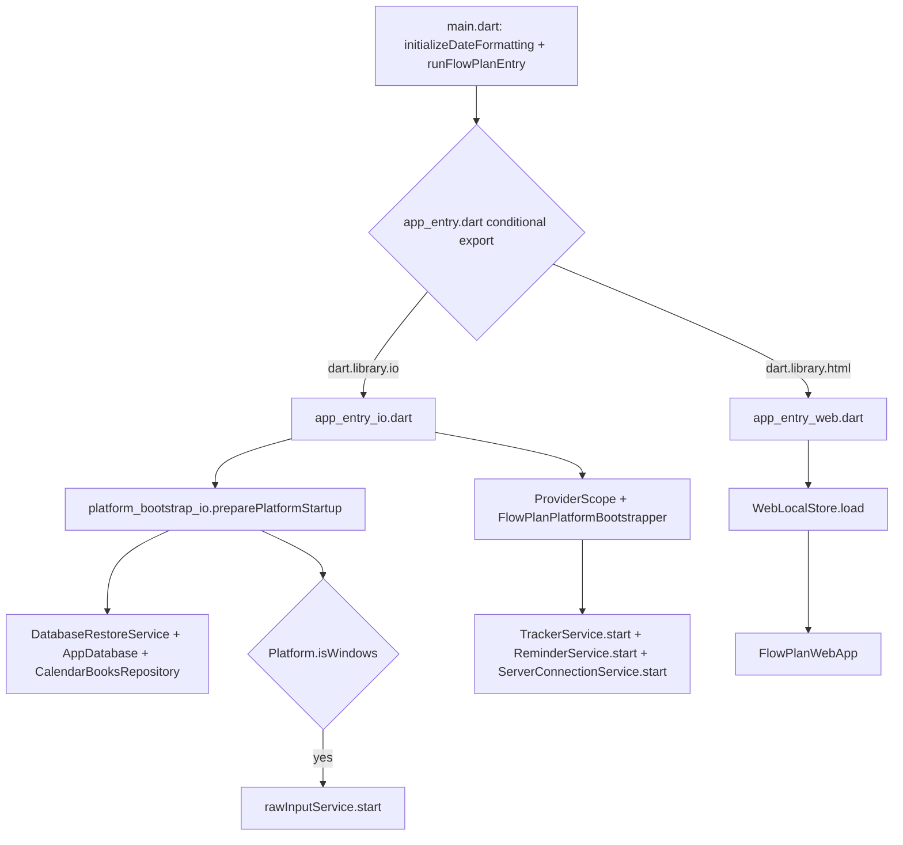

## 2. 认证、健康检查、设备注册与心跳

### 代码证据

| 层 | 证据 |
|---|---|
| 服务端 API | `server/src/auth/auth.controller.ts`、`auth.service.ts`；`health.controller.ts`；`devices.controller.ts`、`devices.service.ts` |
| 服务端数据 | `users`、`devices`、`device_connection_events`、`audit_logs`，见 `server/src/database/p1_schema.sql` 与 `devices.service.ts` SQL |
| Flutter 客户端 | `client_flutter/lib/core/server_api/client_api.dart` 的 heartbeat；`client_flutter/lib/core/bootstrap/client_bootstrap_service.dart` 的启动/同步 |
| Flutter Web | `client_flutter/lib/web_app/flowplan_web_app.dart` 调用 `/client/bootstrap`、`/auth/login`、设备 heartbeat |
| React 管理端 | `web_admin/src/main.tsx` 调用 `/api/health`、`/api/auth/login` |

### 端职责

| 端 | 做了什么 |
|---|---|
| 服务端 | 登录/刷新/登出；健康检查；设备注册、列表、更新、撤销、心跳；心跳更新在线状态并写连接事件。 |
| Windows / Android Flutter | 公共 API client 携带请求上下文，启动后由连接/同步服务触发 bootstrap、heartbeat 和 sync。 |
| Flutter Web | 浏览器端读取/保存 base URL 与登录 token，调用 bootstrap、login、heartbeat。 |
| React 管理端 | 配置 API base、登录并缓存 token，周期性检查 `/api/health`。 |
| 原生 Windows / Android | 本功能无认证实现；仅平台能力供客户端其他流程使用。 |

### 流程图

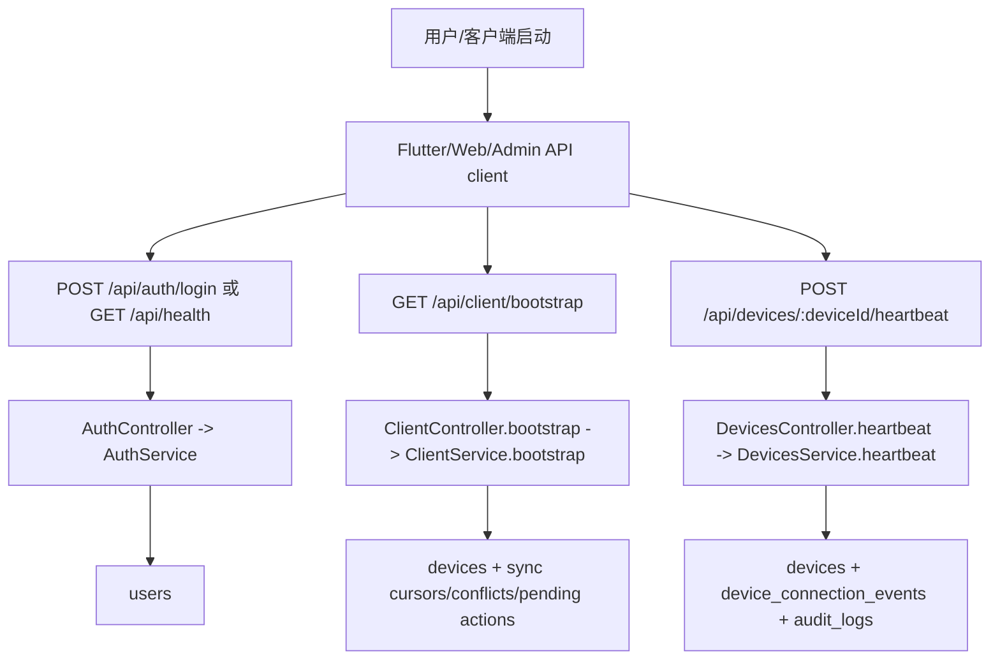

## 3. 任务、日历事件、实际记录、客户端设置、本地快照导入

### 代码证据

| 层 | 证据 |
|---|---|
| 服务端 API | `server/src/client/client.controller.ts`、`client.service.ts`；`server/src/web/web.controller.ts`、`web.service.ts` |
| 客户端 API | `client_flutter/lib/core/server_api/client_api.dart`、`client_flutter/lib/core/server_first/server_first_repository.dart`、`task_event_server_first_store.dart` |
| 本地缓存 | `client_flutter/lib/core/database/tables/task_items_table.dart`、`calendar_events_table.dart`、`app_database.dart` 中 `actual_activity_logs`、`task_schedule_segments` 等 |
| UI | `features/task/*`、`features/calendar/*`、`features/data_management/presentation/data_management_page.dart`、`web_app/flowplan_web_app.dart` |
| 服务端数据 | `sync_objects` 存储 `task_item`、`calendar_event` 等对象；`actual_activity_logs`；`client_import_sessions` |

### 端职责

| 端 | 做了什么 |
|---|---|
| 服务端 | `/client/tasks`、`/client/events` 提供 server-first 任务/事件读写；`/client/actual-records` 查询实际记录；`/client/settings*` 读写设置；本地快照导入 prepare/status/confirm/cancel。 |
| Flutter 公共层 | `ServerFirstRepository` 先远程写 `/client/tasks`、`/client/events`，失败则入 `offline_mutations`；`ClientBootstrapService.buildLocalSnapshot()` 导出本地任务、事件、追踪、文件、报告等表。 |
| Windows 客户端 | 继承公共层；同时本地追踪产生的实际记录/活动数据会进入后续同步或导入流程。 |
| Android 客户端 | 继承公共层；Android usage stats 产生的实际活动记录进入本地库后由同步/上传处理。 |
| Flutter Web | `flowplan_web_app.dart` 直接调用 `/web/tasks`、`/web/events`、`/web/dashboard`，并也调用 `/client/bootstrap`、`/client/settings`。 |
| React 管理端 | 通过 `/api/admin/data/tasks`、`/api/admin/data/schedules`、`/api/admin/data/actuals` 查看/管理事实库数据。 |

### 写入流程图

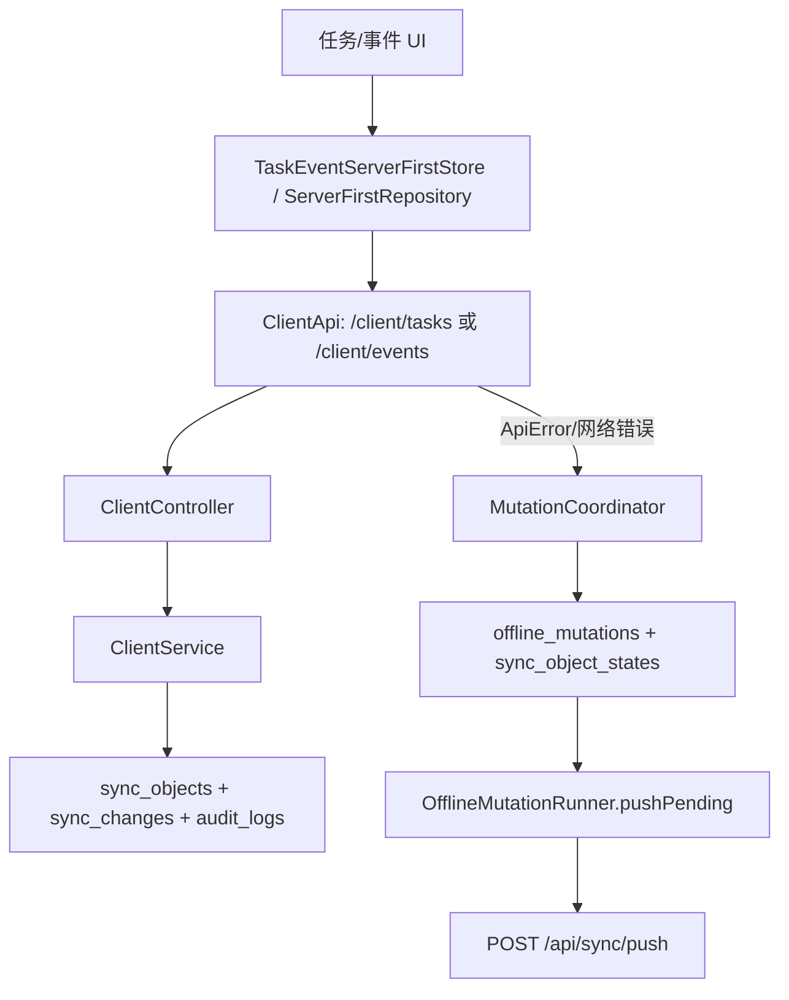

### 本地快照导入流程图

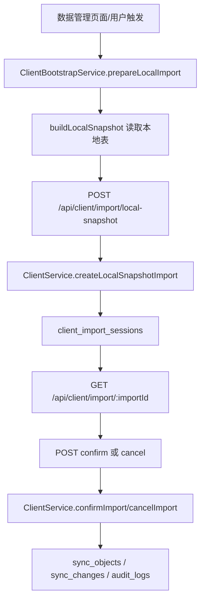

## 4. 离线队列、server-first 写入、同步 push/pull/ack/conflict

### 代码证据

| 层 | 证据 |
|---|---|
| 客户端队列 | `client_flutter/lib/core/offline_queue/offline_mutation_store.dart`、`offline_mutation_runner.dart`、`core/server_first/mutation_coordinator.dart` |
| 客户端同步 | `client_flutter/lib/core/sync/sync_engine.dart`、`sync_cursor_store.dart`、`sync_object_state_store.dart`、`sync_conflict_store.dart`、`server_sync_change_applier.dart` |
| 服务端同步 | `server/src/sync/sync.controller.ts`、`sync.service.ts`；`server/src/client/client.controller.ts` 的 `/client/mutations` 也转入 mutation push |
| 数据表 | 本地 `offline_mutations`、`sync_object_states`、`sync_conflicts`；服务端 `sync_objects`、`sync_mutations`、`sync_changes`、`sync_conflicts`、`sync_cursors` |

### 端职责

| 端 | 做了什么 |
|---|---|
| 服务端 | 接收 mutations，写 `sync_objects` 与 `sync_changes`，生成冲突/拒绝结果；提供 pull、ack、status、conflict resolve。 |
| Flutter 公共层 | 写入失败时排队；`ClientBootstrapService` 启动/定时/写入后触发 `pushPending` 和 `pullChanges`；pull 后本地 apply 并 ack。 |
| Windows / Android | 继承公共同步；本地追踪/提醒/文件等功能产生的数据最终通过同一同步框架或追踪上传进入服务端。 |
| Flutter Web | Web app 主要调用 `/web/*` 与其他 server-first API，没有看到本地离线 mutation runner 接入 `web_app`。 |
| React 管理端 | 查看 `/api/admin/sync-health`、`/api/admin/data/sync-*`、`/api/admin/conflicts`，并可 resolve conflict。 |

### 同步流程图

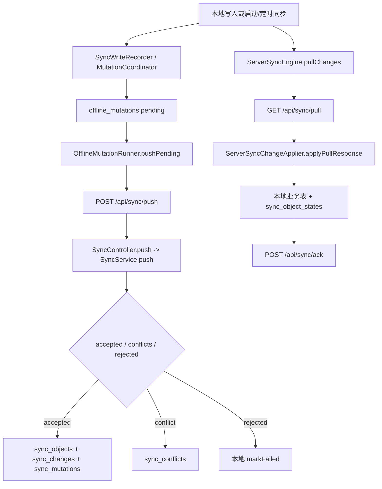

## 5. 行为追踪、Windows RawInput、Android UsageStats、追踪上传、分析查询

### 代码证据

| 层 | 证据 |
|---|---|
| Windows Dart | `window_sensor.dart`、`raw_input_service.dart`、`tracker_service.dart` |
| Windows 原生 | `client_flutter/windows/runner/raw_input_plugin.cpp`、`flutter_window.cpp` |
| Android Dart | `android_usage_stats_service.dart`、`android_usage_import_service.dart`、`tracker_service.dart` |
| Android 原生 | `MainActivity.kt` 的 `com.flowplan.flowplan/android_usage_stats` |
| 追踪上传 | `tracking_upload_service.dart`、`tracking_ingest_api.dart`、`server/src/tracking/*` |
| 分析查询 | `analytics_api.dart`、`server/src/analytics/*`、`client_flutter/lib/web_app/flowplan_web_app.dart` |
| 数据表 | 本地 `activity_records`、`raw_activity_logs`、`tracked_input_events`、`activity_hourly_stats`、`activity_daily_stats`、`input_*_stats`；服务端 `tracking_ingest_batches`、`tracking_ingest_chunks`、`sync_objects` |

### 端职责

| 端 | 做了什么 |
|---|---|
| 服务端 | `/tracking/ingest/batches` 分批接收本地追踪数据；`/analytics/*` 基于服务端对象和统计 SQL 返回热力图、首页、范围分析、top apps/categories、input events 等。 |
| Windows 客户端 | `WindowSensor` 用 Win32 FFI 采样前台窗口；`RawInputService` 通过 MethodChannel 取键盘/鼠标统计；`TrackerService` 每 5 秒采样、分类、写本地记录和日志。 |
| Windows 原生 runner | `RawInputPlugin` 注册 `com.flowplan/raw_input`，支持 `start`、`stop`、`getStats`、`setSequenceRecording`、`resetStats`；后台消息窗口接收键盘/鼠标 RawInput。 |
| Android 客户端 | `AndroidUsageStatsService` 检查权限、打开设置、查询事件；`AndroidUsageImportService` 把前后台事件合并成会话并写本地活动记录和日志。 |
| Android 原生 | `MainActivity.kt` 处理 `getUsageAccessPermissionStatus`、`openUsageAccessSettings`、`queryUsageEvents`，从 `UsageStatsManager` 返回 package/class/app label/event type。 |
| Flutter Web | 不采集原生输入；`flowplan_web_app.dart` 调用 `/analytics/*` 展示追踪分析。 |
| React 管理端 | 查看 `/api/admin/data/tracking-ingest-batches`、仪表盘/监控中的追踪相关数据。 |

### Windows 追踪流程图

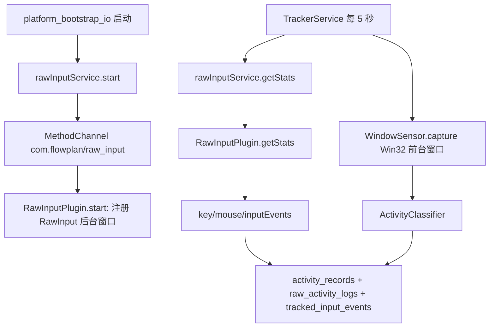

### Android 追踪流程图

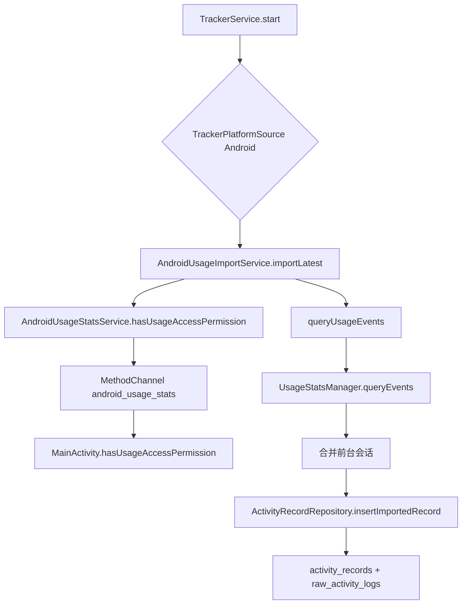

### 追踪上传与分析流程图

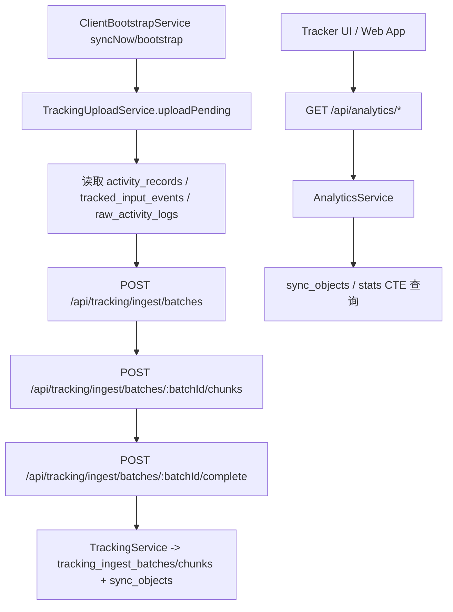

## 6. 活动理解、AI/模型、调度、报告/日记/推送

### 代码证据

| 功能 | 证据 |
|---|---|
| 活动理解 | `server/src/activity-understanding/*`、兼容入口 `server/src/activity/activity.controller.ts`；客户端 `activity_understanding_api.dart`、`activity_understanding_server_first_store.dart` |
| AI 与策略 | `server/src/ai/*`；客户端 `ai_api.dart`、`ai_policy_api.dart` |
| 模型 | `server/src/models/*`；客户端 `models_api.dart` |
| 调度 | `server/src/scheduler/*`；客户端 `scheduler_api.dart`、`scheduler_server_first_store.dart` |
| 报告/日记/推送/天气 | `server/src/reports/*`；客户端 `reports_api.dart`、`features/reports/*`、`web_app/flowplan_web_app.dart` |
| 数据表 | `activity_segments`、`activity_interpretations`、`task_work_logs`、`ai_*`、`model_*`、`schedule_runs`、`schedule_draft_items`、`plan_deviations`、`report_documents`、`diary_entries`、`report_push_deliveries`、`push_channels`、`weather_*` |

### 端职责

| 端 | 做了什么 |
|---|---|
| 服务端 | 生成/查询/确认/拒绝活动片段；AI provider 设置、上下文快照、会话、工具草稿和策略；模型版本/运行/反馈/学习；调度 run 创建/接受/拒绝/偏差检测；报告/日记/天气/推送。 |
| Flutter 公共层 | 通过各 `*_api.dart` 和 server-first store 调用服务端；报告页面与调度/活动审阅页面读取结果并提交确认/拒绝/反馈。 |
| Windows / Android | 作为追踪数据来源，为活动理解、报告、调度偏差提供实际活动数据。 |
| Flutter Web | `flowplan_web_app.dart` 调用活动理解、analytics、reports、diary、weather、push channel/delivery 等接口。 |
| React 管理端 | 配置 AI provider、测试 provider；查看模型运行、AI 草稿、报告、推送、天气等管理数据。 |
| 原生 Windows / Android | 不直接执行 AI/报告/调度逻辑。 |

### 活动理解流程图

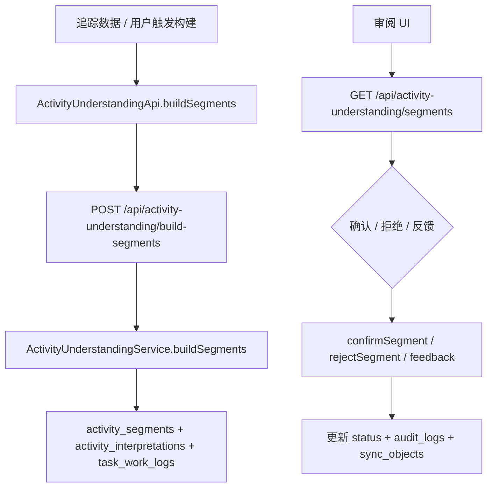

### AI/模型/报告流程图

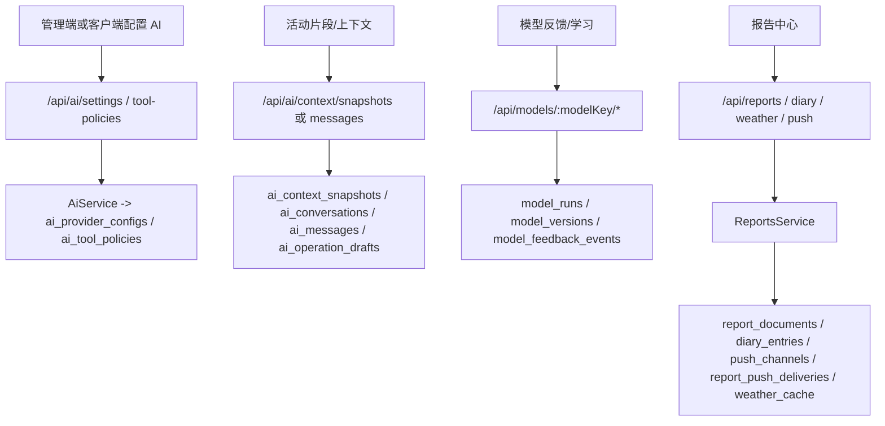

## 7. 文件上下文、文件树、云盘节点、传输、对象存储、Kopia、版本/冲突

### 代码证据

| 层 | 证据 |
|---|---|
| 服务端 API | `server/src/files/files.controller.ts`、`files.service.ts`、`local-object-storage.service.ts`、`kopia.service.ts` |
| 客户端 API | `file_context_api.dart`、`file_cloud_api.dart`、`cloud_drive_server_first_store.dart` |
| 客户端业务 | `features/files/data/file_context_repository.dart`、`file_context_interaction_service.dart`、`file_transfer_service.dart`、`local_file_identity_service.dart` |
| Windows 原生能力 | `DesktopShellService` + `desktop_shell_plugin.cpp` 的 `openPath`、`revealPath` |
| Flutter Web | `flowplan_web_app.dart` 文件浏览、上传 session、分片上传、下载 range |
| React 管理端 | `web_admin/src/main.tsx` 文件数据集和 `/api/files/storage/objects` |
| 数据表 | 服务端 `file_roots`、`file_nodes`、`file_context_links`、`file_storage_objects`、`file_transfer_*`、`file_version_records`、`file_conflict_candidates`、`device_network_presence`；本地 `file_folders`、`file_items`、`file_nodes`、`file_context_links`、`file_version_records` |

### 端职责

| 端 | 做了什么 |
|---|---|
| 服务端 | 管理 providers、roots、tree、drive nodes、context links、recommendations；处理 upload/download sessions、chunks、range、storage objects、network presence、transfer candidates/events、Kopia snapshots/versions、file conflicts。 |
| Windows 客户端 | 本地文件预览/保存、计算 identity、打开/定位路径；向服务端请求 open plan、登记 device location、记录 node operation。 |
| Windows 原生 runner | `openPath`、`revealPath` 使用 `ShellExecuteW`/Explorer；托盘通知也供报告/提醒使用。 |
| Android 客户端 | 代码中没有等价本地文件打开/定位原生实现；只继承 Flutter 公共文件 API 能力。 |
| Flutter Web | 浏览服务端 drive roots/nodes，创建 upload session，逐块上传，complete；创建 download session 并 range 读取。 |
| React 管理端 | 管理查看 file roots/nodes/storage objects/transfer events/file operation logs。 |

### 文件打开/定位流程图

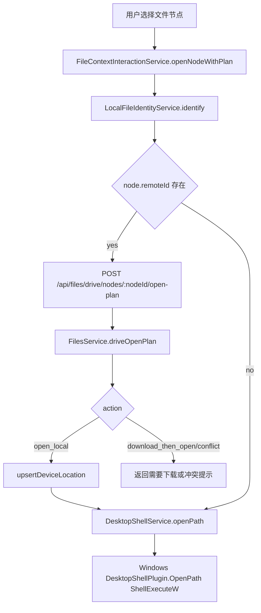

### 上传/下载/版本流程图

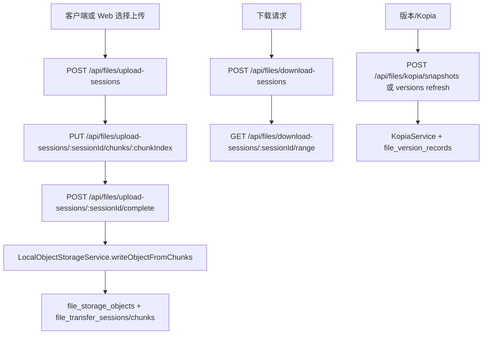

## 8. Web 端业务视图与 `/web/*` 接口

### 代码证据

| 层 | 证据 |
|---|---|
| Flutter Web 启动 | `app_entry_web.dart`、`web_local_store.dart`、`web_api_client.dart` |
| Flutter Web UI | `web_app/flowplan_web_app.dart` |
| 服务端 Web API | `server/src/web/web.controller.ts`、`web.service.ts` |
| 复用服务端能力 | `files.controller.ts`、`analytics.controller.ts`、`reports.controller.ts`、`activity-understanding.controller.ts` |

### 端职责

| 端 | 做了什么 |
|---|---|
| Flutter Web | 保存 base URL/token/deviceId 到浏览器本地 store；调用 `/web/dashboard`、`/web/tasks`、`/web/events`、`/web/reminders`、`/web/operations/*`；还调用 files、analytics、reports 等 API。 |
| 服务端 | `WebController` 把 Web 端轻量任务/事件/操作请求交给 `WebService`，`WebService` 读写 `sync_objects`、`sync_changes`、`sync_conflicts`、`audit_logs`。 |
| Windows / Android 原生 | 不参与 Web 端执行。 |
| React 管理端 | 与 Flutter Web 是不同前端，走 `/api/admin/*`。 |

### 流程图

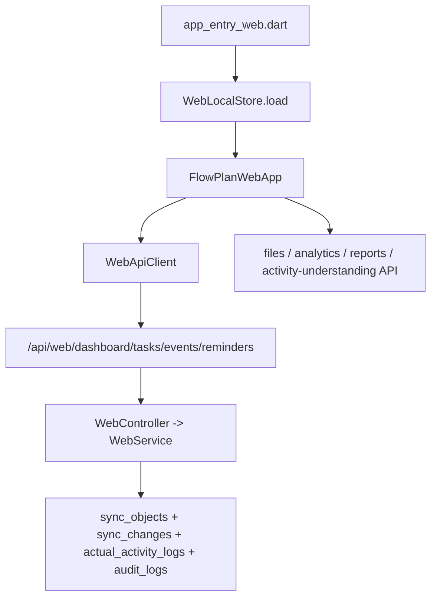

## 9. React 管理端 dashboard、数据中心、同步、文件、模型、报告、监控、运维操作

### 代码证据

| 层 | 证据 |
|---|---|
| React 管理端 | `web_admin/src/main.tsx` |
| 服务端管理 API | `server/src/admin/admin.controller.ts`、`admin.service.ts` |
| 交叉 API | `server/src/ai/ai.controller.ts`、`files.controller.ts`、`health.controller.ts`、`auth.controller.ts` |
| 数据表 | `sync_objects`、`sync_changes`、`sync_mutations`、`devices`、`file_*`、`model_*`、`report_*`、`audit_logs`、`admin_remote_configs`、`server_jobs` |

### 端职责

| 端 | 做了什么 |
|---|---|
| React 管理端 | 管理连接设置、登录、health poll；Dashboard 并行加载 `/api/admin/dashboard` 与 `/api/admin/monitoring/health`；模块页用 dataset endpoint 查询；设置页 PATCH `/api/admin/settings/:configKey`；模型页 PATCH/POST `/api/ai/settings/:providerKey`；操作页 prepare/confirm。 |
| 服务端 | AdminService 汇总 overview/sync health/dashboard；泛化 `adminData(domain)` 和 detail/update；设备在线摘要；监控健康/日志/job；运维操作 prepare/confirm；记录管理动作 audit。 |
| Flutter 客户端/Web | 不实现 React 管理端逻辑。 |
| 原生 Windows/Android | 不参与管理端。 |

### 流程图

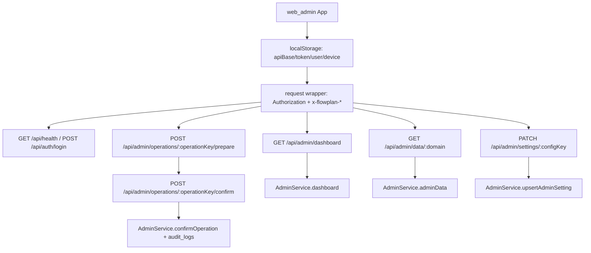

## 10. 服务端接口级明细

服务端控制器共抽取到 209 个 endpoint。每行均来自 `server/src/**/*.controller.ts`。`处理函数` 对应 controller handler；实际业务落在同目录 service 的同名或近似方法中。

### activity-understanding

| 方法 | 路径 | 处理函数 | 代码来源 |
|---|---|---|---|
| POST | `/api/activity-understanding/build-segments` | `buildSegments` | `server/src/activity-understanding/activity-understanding.controller.ts:12` |
| POST | `/api/activity-understanding/build` | `build` | `server/src/activity-understanding/activity-understanding.controller.ts:20` |
| GET | `/api/activity-understanding/segments` | `segments` | `server/src/activity-understanding/activity-understanding.controller.ts:28` |
| POST | `/api/activity-understanding/segments/:segmentId/confirm` | `confirm` | `server/src/activity-understanding/activity-understanding.controller.ts:36` |
| POST | `/api/activity-understanding/segments/:segmentId/reject` | `reject` | `server/src/activity-understanding/activity-understanding.controller.ts:45` |
| POST | `/api/activity-understanding/segments/:segmentId/feedback` | `feedback` | `server/src/activity-understanding/activity-understanding.controller.ts:54` |

### activity

| 方法 | 路径 | 处理函数 | 代码来源 |
|---|---|---|---|
| GET | `/api/activity/segments` | `segments` | `server/src/activity/activity.controller.ts:12` |
| POST | `/api/activity/segments/:segmentId/confirm` | `confirm` | `server/src/activity/activity.controller.ts:20` |
| POST | `/api/activity/segments/:segmentId/reject` | `reject` | `server/src/activity/activity.controller.ts:29` |

### admin

| 方法 | 路径 | 处理函数 | 代码来源 |
|---|---|---|---|
| GET | `/api/admin/overview` | `overview` | `server/src/admin/admin.controller.ts:23` |
| GET | `/api/admin/dashboard` | `dashboard` | `server/src/admin/admin.controller.ts:28` |
| GET | `/api/admin/sync-health` | `syncHealth` | `server/src/admin/admin.controller.ts:33` |
| GET | `/api/admin/data/:domain` | `adminData` | `server/src/admin/admin.controller.ts:38` |
| GET | `/api/admin/data/:domain/:id` | `adminDataDetail` | `server/src/admin/admin.controller.ts:51` |
| GET | `/api/admin/devices/online-summary` | `deviceOnlineSummary` | `server/src/admin/admin.controller.ts:64` |
| GET | `/api/admin/devices/:deviceId/connection-history` | `deviceConnectionHistory` | `server/src/admin/admin.controller.ts:69` |
| PATCH | `/api/admin/data/:domain/:id` | `updateAdminData` | `server/src/admin/admin.controller.ts:80` |
| GET | `/api/admin/settings` | `adminSettings` | `server/src/admin/admin.controller.ts:95` |
| PATCH | `/api/admin/settings/:configKey` | `upsertAdminSetting` | `server/src/admin/admin.controller.ts:100` |
| GET | `/api/admin/monitoring/health` | `monitoringHealth` | `server/src/admin/admin.controller.ts:113` |
| GET | `/api/admin/monitoring/logs` | `monitoringLogs` | `server/src/admin/admin.controller.ts:118` |
| GET | `/api/admin/monitoring/jobs` | `monitoringJobs` | `server/src/admin/admin.controller.ts:126` |
| POST | `/api/admin/operations/:operationKey/prepare` | `prepareOperation` | `server/src/admin/admin.controller.ts:131` |
| POST | `/api/admin/operations/:operationKey/confirm` | `confirmOperation` | `server/src/admin/admin.controller.ts:144` |
| GET | `/api/admin/objects` | `objects` | `server/src/admin/admin.controller.ts:157` |
| PATCH | `/api/admin/objects/:objectId` | `updateObject` | `server/src/admin/admin.controller.ts:165` |
| GET | `/api/admin/actual-records` | `actualRecords` | `server/src/admin/admin.controller.ts:178` |
| PATCH | `/api/admin/actual-records/:actualId` | `updateActualRecord` | `server/src/admin/admin.controller.ts:186` |
| GET | `/api/admin/files` | `files` | `server/src/admin/admin.controller.ts:199` |
| PATCH | `/api/admin/files/:fileId` | `updateFile` | `server/src/admin/admin.controller.ts:204` |
| GET | `/api/admin/conflicts` | `conflicts` | `server/src/admin/admin.controller.ts:213` |
| POST | `/api/admin/conflicts/:conflictId/resolve` | `resolveConflict` | `server/src/admin/admin.controller.ts:218` |
| GET | `/api/admin/outlook` | `outlook` | `server/src/admin/admin.controller.ts:233` |
| GET | `/api/admin/audit-logs` | `auditLogs` | `server/src/admin/admin.controller.ts:238` |
| GET | `/api/admin/reports` | `reports` | `server/src/admin/admin.controller.ts:246` |
| GET | `/api/admin/push-deliveries` | `pushDeliveries` | `server/src/admin/admin.controller.ts:254` |
| GET | `/api/admin/ai-drafts` | `aiDrafts` | `server/src/admin/admin.controller.ts:262` |
| PATCH | `/api/admin/ai-drafts/:draftId` | `updateAiDraft` | `server/src/admin/admin.controller.ts:270` |
| GET | `/api/admin/jobs` | `jobs` | `server/src/admin/admin.controller.ts:283` |
| PATCH | `/api/admin/jobs/:jobKey` | `upsertJob` | `server/src/admin/admin.controller.ts:288` |
| GET | `/api/admin/remote-configs` | `remoteConfigs` | `server/src/admin/admin.controller.ts:297` |
| PATCH | `/api/admin/remote-configs/:configKey` | `upsertRemoteConfig` | `server/src/admin/admin.controller.ts:302` |

### ai

| 方法 | 路径 | 处理函数 | 代码来源 |
|---|---|---|---|
| GET | `/api/ai/settings` | `settings` | `server/src/ai/ai.controller.ts:18` |
| PATCH | `/api/ai/settings/:providerKey` | `upsertProvider` | `server/src/ai/ai.controller.ts:23` |
| POST | `/api/ai/settings/:providerKey/test` | `testProvider` | `server/src/ai/ai.controller.ts:36` |
| GET | `/api/ai/context` | `context` | `server/src/ai/ai.controller.ts:44` |
| POST | `/api/ai/context/snapshots` | `createContextSnapshot` | `server/src/ai/ai.controller.ts:49` |
| GET | `/api/ai/tool-policies` | `toolPolicies` | `server/src/ai/ai.controller.ts:57` |
| PATCH | `/api/ai/tool-policies/:toolName` | `upsertToolPolicy` | `server/src/ai/ai.controller.ts:62` |
| GET | `/api/ai/conversations` | `conversations` | `server/src/ai/ai.controller.ts:75` |
| POST | `/api/ai/conversations` | `createConversation` | `server/src/ai/ai.controller.ts:83` |
| GET | `/api/ai/conversations/:conversationId/messages` | `messages` | `server/src/ai/ai.controller.ts:91` |
| POST | `/api/ai/messages` | `sendMessage` | `server/src/ai/ai.controller.ts:99` |
| POST | `/api/ai/activity-segments/:segmentId/explain` | `explainActivitySegment` | `server/src/ai/ai.controller.ts:107` |
| GET | `/api/ai/tool-drafts` | `toolDrafts` | `server/src/ai/ai.controller.ts:120` |
| PATCH | `/api/ai/tool-drafts/:draftId` | `reviewDraft` | `server/src/ai/ai.controller.ts:128` |
| POST | `/api/ai/tool-drafts/:draftId/confirm` | `confirmDraft` | `server/src/ai/ai.controller.ts:141` |

### analytics

| 方法 | 路径 | 处理函数 | 代码来源 |
|---|---|---|---|
| GET | `/api/analytics/activity-heatmap` | `activityHeatmap` | `server/src/analytics/analytics.controller.ts:9` |
| GET | `/api/analytics/tracker-home` | `trackerHome` | `server/src/analytics/analytics.controller.ts:20` |
| GET | `/api/analytics/activity-day-summary` | `activityDaySummary` | `server/src/analytics/analytics.controller.ts:28` |
| GET | `/api/analytics/range-analysis` | `rangeAnalysis` | `server/src/analytics/analytics.controller.ts:39` |
| GET | `/api/analytics/filter-options` | `filterOptions` | `server/src/analytics/analytics.controller.ts:50` |
| GET | `/api/analytics/input-heatmap` | `inputHeatmap` | `server/src/analytics/analytics.controller.ts:61` |
| GET | `/api/analytics/activity-range-summary` | `activityRangeSummary` | `server/src/analytics/analytics.controller.ts:69` |
| GET | `/api/analytics/top-apps` | `topApps` | `server/src/analytics/analytics.controller.ts:80` |
| GET | `/api/analytics/top-categories` | `topCategories` | `server/src/analytics/analytics.controller.ts:88` |
| GET | `/api/analytics/task-work-summary` | `taskWorkSummary` | `server/src/analytics/analytics.controller.ts:99` |
| GET | `/api/analytics/focus-trends` | `focusTrends` | `server/src/analytics/analytics.controller.ts:110` |
| GET | `/api/analytics/activity-records` | `activityRecords` | `server/src/analytics/analytics.controller.ts:118` |
| GET | `/api/analytics/input-events` | `inputEvents` | `server/src/analytics/analytics.controller.ts:129` |

### auth / health / devices

| 方法 | 路径 | 处理函数 | 代码来源 |
|---|---|---|---|
| POST | `/api/auth/login` | `login` | `server/src/auth/auth.controller.ts:8` |
| POST | `/api/auth/refresh` | `refresh` | `server/src/auth/auth.controller.ts:13` |
| POST | `/api/auth/logout` | `logout` | `server/src/auth/auth.controller.ts:18` |
| GET | `/api/health` | `check` | `server/src/health/health.controller.ts:12` |
| POST | `/api/devices/register` | `register` | `server/src/devices/devices.controller.ts:9` |
| GET | `/api/devices` | `list` | `server/src/devices/devices.controller.ts:17` |
| PATCH | `/api/devices/:deviceId` | `update` | `server/src/devices/devices.controller.ts:22` |
| POST | `/api/devices/:deviceId/revoke` | `revoke` | `server/src/devices/devices.controller.ts:31` |
| POST | `/api/devices/:deviceId/heartbeat` | `heartbeat` | `server/src/devices/devices.controller.ts:40` |

### client

| 方法 | 路径 | 处理函数 | 代码来源 |
|---|---|---|---|
| GET | `/api/client/bootstrap` | `bootstrap` | `server/src/client/client.controller.ts:26` |
| GET | `/api/client/settings` | `settings` | `server/src/client/client.controller.ts:31` |
| GET | `/api/client/settings/effective` | `effectiveSettings` | `server/src/client/client.controller.ts:36` |
| PATCH | `/api/client/settings/:key` | `updateSetting` | `server/src/client/client.controller.ts:41` |
| GET | `/api/client/settings-policy` | `settingsPolicy` | `server/src/client/client.controller.ts:50` |
| GET | `/api/client/tasks` | `tasks` | `server/src/client/client.controller.ts:55` |
| POST | `/api/client/tasks` | `createTask` | `server/src/client/client.controller.ts:63` |
| PATCH | `/api/client/tasks/:id` | `updateTask` | `server/src/client/client.controller.ts:71` |
| POST | `/api/client/tasks/:id/complete` | `completeTask` | `server/src/client/client.controller.ts:80` |
| DELETE | `/api/client/tasks/:id` | `deleteTask` | `server/src/client/client.controller.ts:89` |
| GET | `/api/client/events` | `events` | `server/src/client/client.controller.ts:97` |
| POST | `/api/client/events` | `createEvent` | `server/src/client/client.controller.ts:105` |
| PATCH | `/api/client/events/:id` | `updateEvent` | `server/src/client/client.controller.ts:113` |
| DELETE | `/api/client/events/:id` | `deleteEvent` | `server/src/client/client.controller.ts:122` |
| GET | `/api/client/actual-records` | `actualRecords` | `server/src/client/client.controller.ts:130` |
| POST | `/api/client/mutations` | `pushMutations` | `server/src/client/client.controller.ts:138` |
| POST | `/api/client/import/local-snapshot` | `createLocalSnapshotImport` | `server/src/client/client.controller.ts:146` |
| GET | `/api/client/import/:importId` | `importStatus` | `server/src/client/client.controller.ts:157` |
| POST | `/api/client/import/:importId/confirm` | `confirmImport` | `server/src/client/client.controller.ts:165` |
| POST | `/api/client/import/:importId/cancel` | `cancelImport` | `server/src/client/client.controller.ts:173` |

### files

| 方法 | 路径 | 处理函数 | 代码来源 |
|---|---|---|---|
| GET | `/api/files/providers` | `providers` | `server/src/files/files.controller.ts:19` |
| GET | `/api/files/dashboard` | `dashboard` | `server/src/files/files.controller.ts:24` |
| PATCH | `/api/files/providers/:providerKey` | `upsertProvider` | `server/src/files/files.controller.ts:29` |
| POST | `/api/files/tree/snapshot` | `applyTreeSnapshot` | `server/src/files/files.controller.ts:42` |
| GET | `/api/files/tree` | `tree` | `server/src/files/files.controller.ts:50` |
| GET | `/api/files/roots` | `roots` | `server/src/files/files.controller.ts:58` |
| GET | `/api/files/drive/roots` | `driveRoots` | `server/src/files/files.controller.ts:66` |
| POST | `/api/files/roots` | `upsertRoot` | `server/src/files/files.controller.ts:74` |
| GET | `/api/files/nodes` | `fileNodes` | `server/src/files/files.controller.ts:82` |
| GET | `/api/files/drive/nodes` | `driveNodes` | `server/src/files/files.controller.ts:90` |
| GET | `/api/files/drive/nodes/:nodeId` | `driveNode` | `server/src/files/files.controller.ts:98` |
| POST | `/api/files/drive/nodes/:nodeId/open-plan` | `driveOpenPlan` | `server/src/files/files.controller.ts:106` |
| POST | `/api/files/drive/nodes/:nodeId/device-location` | `upsertDriveDeviceLocation` | `server/src/files/files.controller.ts:119` |
| POST | `/api/files/drive/nodes/:nodeId/download-request` | `createDriveDownloadRequest` | `server/src/files/files.controller.ts:132` |
| POST | `/api/files/drive/roots/:rootId/scan` | `scanDriveRoot` | `server/src/files/files.controller.ts:145` |
| POST | `/api/files/drive/nodes/:nodeId/relink` | `relinkDriveNode` | `server/src/files/files.controller.ts:158` |
| POST | `/api/files/nodes/snapshot` | `applyNodeSnapshot` | `server/src/files/files.controller.ts:171` |
| POST | `/api/files/nodes/:nodeId/log` | `logNodeOperation` | `server/src/files/files.controller.ts:179` |
| POST | `/api/files/context-links` | `linkNodeToEntity` | `server/src/files/files.controller.ts:192` |
| GET | `/api/files/context-links` | `contextLinks` | `server/src/files/files.controller.ts:200` |
| GET | `/api/files/recommendations` | `recommendations` | `server/src/files/files.controller.ts:208` |
| POST | `/api/files/recommendations/:recommendationId/review` | `reviewRecommendation` | `server/src/files/files.controller.ts:216` |
| POST | `/api/files/upload-sessions` | `createUploadSession` | `server/src/files/files.controller.ts:229` |
| POST | `/api/files/transfers/upload-session` | `createUploadTransferSession` | `server/src/files/files.controller.ts:237` |
| PUT | `/api/files/upload-sessions/:sessionId/chunks/:chunkIndex` | `uploadChunk` | `server/src/files/files.controller.ts:245` |
| POST | `/api/files/transfers/:sessionId/chunks/:chunkIndex` | `uploadTransferChunk` | `server/src/files/files.controller.ts:260` |
| GET | `/api/files/upload-sessions/:sessionId/missing-chunks` | `missingUploadChunks` | `server/src/files/files.controller.ts:275` |
| GET | `/api/files/transfers/:sessionId/missing-chunks` | `missingTransferUploadChunks` | `server/src/files/files.controller.ts:286` |
| POST | `/api/files/upload-sessions/:sessionId/complete` | `completeUploadSession` | `server/src/files/files.controller.ts:297` |
| POST | `/api/files/transfers/:sessionId/complete` | `completeUploadTransferSession` | `server/src/files/files.controller.ts:308` |
| POST | `/api/files/download-sessions` | `createDownloadSession` | `server/src/files/files.controller.ts:319` |
| GET | `/api/files/download-sessions/:sessionId/range` | `downloadRange` | `server/src/files/files.controller.ts:330` |
| GET | `/api/files/storage/:objectId/download` | `downloadStorageObject` | `server/src/files/files.controller.ts:343` |
| GET | `/api/files/transfers` | `transfers` | `server/src/files/files.controller.ts:356` |
| GET | `/api/files/transfers/:sessionId/progress` | `transferProgress` | `server/src/files/files.controller.ts:364` |
| POST | `/api/files/network-presence` | `upsertNetworkPresence` | `server/src/files/files.controller.ts:375` |
| GET | `/api/files/network-presence` | `networkPresence` | `server/src/files/files.controller.ts:386` |
| GET | `/api/files/transfers/:sessionId/candidates` | `transferCandidates` | `server/src/files/files.controller.ts:391` |
| POST | `/api/files/transfers/:sessionId/candidates` | `upsertTransferCandidate` | `server/src/files/files.controller.ts:402` |
| POST | `/api/files/transfers/:sessionId/events` | `appendTransferEvent` | `server/src/files/files.controller.ts:415` |
| GET | `/api/files/storage/status` | `storageStatus` | `server/src/files/files.controller.ts:428` |
| GET | `/api/files/storage/objects` | `storageObjects` | `server/src/files/files.controller.ts:433` |
| POST | `/api/files/storage/register` | `registerStorageObject` | `server/src/files/files.controller.ts:441` |
| POST | `/api/files/kopia/snapshots` | `createKopiaSnapshot` | `server/src/files/files.controller.ts:452` |
| POST | `/api/files/kopia/versions/refresh` | `refreshKopiaVersions` | `server/src/files/files.controller.ts:460` |
| GET | `/api/files/versions/:fileId` | `versions` | `server/src/files/files.controller.ts:468` |
| POST | `/api/files/versions/:versionId/download-requests` | `createVersionDownloadRequest` | `server/src/files/files.controller.ts:476` |
| POST | `/api/files/versions/:versionId/download-copy` | `downloadVersionCopy` | `server/src/files/files.controller.ts:489` |
| POST | `/api/files/versions/:versionId/restore-prepare` | `prepareVersionRestore` | `server/src/files/files.controller.ts:502` |
| GET | `/api/files/conflicts` | `conflicts` | `server/src/files/files.controller.ts:515` |
| POST | `/api/files/conflicts` | `createConflict` | `server/src/files/files.controller.ts:520` |
| POST | `/api/files/conflicts/:conflictId/resolve` | `resolveConflict` | `server/src/files/files.controller.ts:528` |

### models

| 方法 | 路径 | 处理函数 | 代码来源 |
|---|---|---|---|
| GET | `/api/models` | `list` | `server/src/models/models.controller.ts:9` |
| GET | `/api/models/llm/health` | `llmHealth` | `server/src/models/models.controller.ts:14` |
| GET | `/api/models/:modelKey/versions` | `versions` | `server/src/models/models.controller.ts:19` |
| GET | `/api/models/:modelKey/runs` | `runs` | `server/src/models/models.controller.ts:27` |
| POST | `/api/models/:modelKey/feedback` | `feedback` | `server/src/models/models.controller.ts:36` |
| POST | `/api/models/:modelKey/evaluate` | `evaluate` | `server/src/models/models.controller.ts:45` |
| POST | `/api/models/:modelKey/learn` | `learn` | `server/src/models/models.controller.ts:54` |
| POST | `/api/models/:modelKey/versions/:versionId/activate` | `activate` | `server/src/models/models.controller.ts:63` |

### reports / diary / push / weather

| 方法 | 路径 | 处理函数 | 代码来源 |
|---|---|---|---|
| GET | `/api/reports` | `reports` | `server/src/reports/reports.controller.ts:9` |
| GET | `/api/reports/:reportId` | `report` | `server/src/reports/reports.controller.ts:14` |
| POST | `/api/reports/generate` | `generateReport` | `server/src/reports/reports.controller.ts:19` |
| PATCH | `/api/reports/:reportId` | `updateReport` | `server/src/reports/reports.controller.ts:27` |
| POST | `/api/reports/:reportId/confirm` | `confirmReport` | `server/src/reports/reports.controller.ts:36` |
| POST | `/api/reports/:reportId/polish` | `polishReport` | `server/src/reports/reports.controller.ts:44` |
| POST | `/api/reports/:reportId/push` | `pushReport` | `server/src/reports/reports.controller.ts:52` |
| GET | `/api/diary` | `diary` | `server/src/reports/reports.controller.ts:61` |
| POST | `/api/diary/generate` | `generateDiary` | `server/src/reports/reports.controller.ts:66` |
| PATCH | `/api/diary/:diaryId` | `updateDiary` | `server/src/reports/reports.controller.ts:74` |
| POST | `/api/diary/:diaryId/confirm` | `confirmDiary` | `server/src/reports/reports.controller.ts:83` |
| POST | `/api/diary/:diaryId/polish` | `polishDiary` | `server/src/reports/reports.controller.ts:91` |
| GET | `/api/report-templates` | `templates` | `server/src/reports/reports.controller.ts:99` |
| POST | `/api/report-templates` | `upsertTemplate` | `server/src/reports/reports.controller.ts:104` |
| GET | `/api/push/channels` | `pushChannels` | `server/src/reports/reports.controller.ts:112` |
| POST | `/api/push/channels` | `upsertPushChannel` | `server/src/reports/reports.controller.ts:117` |
| GET | `/api/push/deliveries` | `pushDeliveries` | `server/src/reports/reports.controller.ts:125` |
| POST | `/api/push/deliveries/:deliveryId/retry` | `retryDelivery` | `server/src/reports/reports.controller.ts:130` |
| GET | `/api/weather/locations` | `weatherLocations` | `server/src/reports/reports.controller.ts:138` |
| POST | `/api/weather/locations` | `upsertWeatherLocation` | `server/src/reports/reports.controller.ts:143` |
| POST | `/api/weather/locations/:locationId/refresh` | `refreshWeather` | `server/src/reports/reports.controller.ts:151` |
| GET | `/api/weather/summary` | `weatherSummary` | `server/src/reports/reports.controller.ts:159` |

### scheduler

| 方法 | 路径 | 处理函数 | 代码来源 |
|---|---|---|---|
| POST | `/api/scheduler/runs` | `createRun` | `server/src/scheduler/scheduler.controller.ts:9` |
| GET | `/api/scheduler/runs/:runId` | `run` | `server/src/scheduler/scheduler.controller.ts:17` |
| POST | `/api/scheduler/runs/:runId/accept` | `acceptRun` | `server/src/scheduler/scheduler.controller.ts:25` |
| POST | `/api/scheduler/runs/:runId/reject` | `rejectRun` | `server/src/scheduler/scheduler.controller.ts:34` |
| POST | `/api/scheduler/deviations/detect` | `detectDeviations` | `server/src/scheduler/scheduler.controller.ts:43` |

### sync

| 方法 | 路径 | 处理函数 | 代码来源 |
|---|---|---|---|
| POST | `/api/sync/push` | `push` | `server/src/sync/sync.controller.ts:10` |
| GET | `/api/sync/pull` | `pull` | `server/src/sync/sync.controller.ts:18` |
| POST | `/api/sync/ack` | `ack` | `server/src/sync/sync.controller.ts:31` |
| GET | `/api/sync/conflicts` | `conflicts` | `server/src/sync/sync.controller.ts:39` |
| GET | `/api/sync/status` | `status` | `server/src/sync/sync.controller.ts:44` |
| POST | `/api/sync/conflicts/:conflictId/resolve` | `resolveConflict` | `server/src/sync/sync.controller.ts:49` |

### tracking

| 方法 | 路径 | 处理函数 | 代码来源 |
|---|---|---|---|
| POST | `/api/tracking/ingest/batches` | `createBatch` | `server/src/tracking/tracking.controller.ts:9` |
| GET | `/api/tracking/ingest/batches` | `batches` | `server/src/tracking/tracking.controller.ts:17` |
| POST | `/api/tracking/ingest/batches/:batchId/chunks` | `appendChunk` | `server/src/tracking/tracking.controller.ts:25` |
| POST | `/api/tracking/ingest/batches/:batchId/complete` | `completeBatch` | `server/src/tracking/tracking.controller.ts:38` |
| GET | `/api/tracking/summary` | `summary` | `server/src/tracking/tracking.controller.ts:51` |
| GET | `/api/tracking/spool-status` | `spoolStatus` | `server/src/tracking/tracking.controller.ts:59` |

### web

| 方法 | 路径 | 处理函数 | 代码来源 |
|---|---|---|---|
| GET | `/api/web/dashboard` | `dashboard` | `server/src/web/web.controller.ts:9` |
| GET | `/api/web/tasks` | `tasks` | `server/src/web/web.controller.ts:14` |
| POST | `/api/web/tasks` | `createTask` | `server/src/web/web.controller.ts:19` |
| PATCH | `/api/web/tasks/:id` | `updateTask` | `server/src/web/web.controller.ts:24` |
| GET | `/api/web/events` | `events` | `server/src/web/web.controller.ts:33` |
| POST | `/api/web/events` | `createEvent` | `server/src/web/web.controller.ts:38` |
| PATCH | `/api/web/events/:id` | `updateEvent` | `server/src/web/web.controller.ts:43` |
| GET | `/api/web/actual-records` | `actualRecords` | `server/src/web/web.controller.ts:52` |
| GET | `/api/web/reminders` | `reminders` | `server/src/web/web.controller.ts:57` |
| POST | `/api/web/operations/:operationKey/prepare` | `prepareOperation` | `server/src/web/web.controller.ts:62` |
| POST | `/api/web/operations/:operationKey/confirm` | `confirmOperation` | `server/src/web/web.controller.ts:71` |

## 11. 客户端调用覆盖与断链

### 已看到的主要调用端

| 调用端 | 代码证据 | 调用范围 |
|---|---|---|
| Flutter server API clients | `client_flutter/lib/core/server_api/*.dart` | `/client/*`、`/sync/*`、`/devices/*`、`/files/*`、`/tracking/*`、`/analytics/*`、`/activity-understanding/*`、`/ai/*`、`/models/*`、`/scheduler/*`、`/reports`、`/diary`、`/push/*`、`/weather/*` |
| Flutter Web app | `client_flutter/lib/web_app/flowplan_web_app.dart`、`web_api_client.dart` | `/web/*`、`/client/bootstrap`、`/auth/login`、文件 API、analytics、activity-understanding、reports/diary/weather/push |
| React 管理端 | `web_admin/src/main.tsx` | `/api/health`、`/api/auth/login`、`/api/admin/*`、`/api/files/storage/objects`、`/api/ai/settings/*` |
| Windows MethodChannel | `desktop_shell_service.dart`、`raw_input_service.dart`、`desktop_shell_plugin.cpp`、`raw_input_plugin.cpp` | `com.flowplan/desktop_shell`、`com.flowplan/raw_input` |
| Android MethodChannel | `android_usage_stats_service.dart`、`reminder_service.dart`、`MainActivity.kt`、`ReminderScheduler.kt` | `com.flowplan.flowplan/android_usage_stats`、`com.flowplan.flowplan/android_reminders` |

### 代码中存在但未找到直接客户端调用的服务端接口

以下结论来自静态字符串搜索，动态拼接可能导致漏判。

| 接口族 | 情况 |
|---|---|
| `/api/activity/*` | 存在兼容 controller，但客户端主要调用 `/activity-understanding/*`。 |
| 部分 `/api/admin/*` 专用接口 | React 管理端主要使用 `adminData(domain)`、dashboard、settings、monitoring、operations；`/admin/objects`、`/admin/actual-records`、`/admin/files`、`/admin/outlook`、`/admin/reports`、`/admin/push-deliveries`、`/admin/ai-drafts`、`/admin/jobs`、`/admin/remote-configs` 在代码中作为服务端 API 暴露，未在 `web_admin/src/main.tsx` 中逐一看到直接调用。 |
| `/api/devices/register`、`GET/PATCH/revoke /api/devices*` | 服务端存在；客户端静态搜索主要看到 heartbeat，管理端通过 `/api/admin/devices/*` 查看在线摘要。 |
| `/api/files/transfers/upload-session`、`/api/files/transfers/:sessionId/chunks/:chunkIndex`、`/complete`、`/missing-chunks` | 服务端存在；客户端 `file_cloud_api.dart` 主要覆盖 transfer 查询、presence、candidate/event 和 upload-sessions，是否调用 transfer upload 取决于 `file_transfer_service.dart` 运行路径。 |
| `/api/models/:modelKey/evaluate`、`/versions/:versionId/activate` | 服务端存在；客户端 `models_api.dart` 静态调用覆盖 list/health/versions/runs/feedback/learn，未看到 evaluate/activate API client 方法。 |
| `/api/auth/refresh`、`/api/auth/logout` | 服务端存在；Web/Admin 静态代码看到 login，未看到 refresh/logout 调用。 |

### 客户端调用但需注意匹配方式的接口

| 调用 | 情况 |
|---|---|
| React 管理端 `/api/admin/data/<domain>` | 服务端用动态 `/api/admin/data/:domain` 处理，因此 `tasks`、`schedules`、`actuals`、`file-roots`、`model-runs` 等不是独立 controller 路由。 |
| Flutter API client 无 `/api` 前缀 | `ApiClient` 与 `WebApiClient` 将 base URL 设为 `http://localhost:3200/api`，所以代码中的 `/client/tasks` 实际请求 `/api/client/tasks`。 |
| Flutter Web app 动态 endpoint | `_AsyncJsonPanel` 等组件把 endpoint 字符串传给 `api.getJson(endpoint)`，已按静态字符串归并。 |

## 12. 平台通道校验

| 通道 | Dart 侧 | 原生侧 | 方法 |
|---|---|---|---|
| `com.flowplan/raw_input` | `client_flutter/lib/features/tracker/services/raw_input_service.dart` | `client_flutter/windows/runner/raw_input_plugin.cpp` | `start`、`stop`、`getStats`、`setSequenceRecording`、`resetStats` |
| `com.flowplan/desktop_shell` | `client_flutter/lib/core/platform/desktop_shell_service.dart` | `client_flutter/windows/runner/desktop_shell_plugin.cpp` | `setCloseToTrayEnabled`、`getLaunchAtStartupEnabled`、`setLaunchAtStartupEnabled`、`showReminder`、`openPath`、`revealPath` |
| `com.flowplan.flowplan/android_usage_stats` | `client_flutter/lib/features/tracker/services/android_usage_stats_service.dart` | `client_flutter/android/app/src/main/kotlin/com/flowplan/flowplan/MainActivity.kt` | `getUsageAccessPermissionStatus`、`openUsageAccessSettings`、`queryUsageEvents` |
| `com.flowplan.flowplan/android_reminders` | `client_flutter/lib/features/reminders/reminder_service.dart` | `MainActivity.kt` + `ReminderScheduler.kt` + receivers | `canScheduleExactAlarms`、`openExactAlarmSettings`、`pendingExactReminderCount`、`scheduleExactReminder`、`cancelAllExactReminders` |

## 13. 覆盖校验结果

| 校验项 | 结果 |
|---|---|
| 服务端 endpoint 覆盖 | `server/src/**/*.controller.ts` 共 209 个 endpoint，已全部列入“服务端接口级明细”。 |
| 客户端 API 调用覆盖 | 已检查 `client_flutter/lib/core/server_api`、`client_flutter/lib/web_app`、`web_admin/src/main.tsx` 的静态 path；动态 domain/path 以对应 controller 通配接口归并。 |
| 平台通道覆盖 | Windows `desktop_shell`、`raw_input` 与 Android `android_usage_stats`、`android_reminders` 已列入端职责和平台通道校验。 |
| 图表覆盖 | 每个产品功能组均有 Mermaid 流程图；复杂组拆分为启动、写入/同步、追踪采集/上传/分析、文件打开/传输、管理端等流程。 |
| 证据限制 | 本文没有把说明文档中的需求当作功能来源；只记录代码中能定位到的行为。 |

